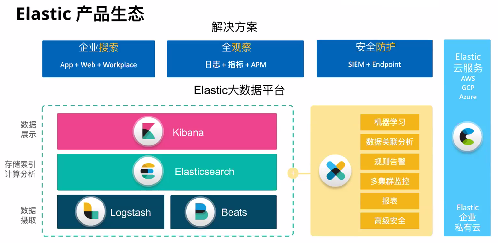

# ELK

> [ELK Stack：Elasticsearch、Logstash 和 Kibana | Elastic](https://www.elastic.co/cn/what-is/elk-stack)

**ELK 到底是什么呢？** “ELK”是三个开源项目的首字母缩写，这三个项目分别是：Elasticsearch、Logstash 和 Kibana。

Elasticsearch 是一个搜索和分析引擎。

Logstash 是服务器端数据处理管道，能够同时从多个来源采集数据，转换数据，然后将数据发送到诸如 Elasticsearch 等“存储库”中。

Kibana 则可以让用户在 Elasticsearch 中使用图形和图表对数据进行可视化。

Elastic Stack 是 ELK Stack 的更新换代产品。

> ELK = ElasticSearch + Logstash + Kibana
> 
> 随着Beats的加入，原来的ELK体系变成了ElasticStack，即
> 
> ElasticStack = ElasticSearch + Logstash + Kibana + Beats

---

**一切都起源于 Elasticsearch**

这个开源的分布式搜索引擎基于 JSON 开发而来，具有 RESTful 风格。它使用简单，可缩放规模，十分灵活，因此受到用户的热烈好评，而且如大家所知，围绕这一产品还形成了一家专门致力于搜索的公司。

**引入 Logstash 和 Kibana，产品更强大**

Elasticsearch 的核心是搜索引擎，所以用户开始将其用于日志用例，并希望能够轻松地对日志进行采集和可视化。有鉴于此，我们引入了强大的采集管道 Logstash 和灵活的可视化工具 Kibana。 

**我们向 ELK 中加入了 Beats**

“我只想对某个文件进行 tail 操作，”用户表示。我们用心倾听。在 2015 年，我们向 ELK Stack 中加入了一系列轻量型的单一功能数据采集器，并把它们叫做 Beats。

----

## Elastic 生态圈

### Elasticsearch

Elasticsearch 基于java，是个开源分布式搜索引擎，它的特点有：分布式，零配置，自动发现，索引自动分片，索引
副本机制，restful风格接口，多数据源，自动搜索负载等。

### Logstash

Logstash 基于java，是一个开源的用于收集,分析和存储日志的工具。

### Kibana

Kibana 基于nodejs，也是一个开源和免费的工具，Kibana可以为 Logstash 和 ElasticSearch 提供的日志分析友好的
Web 界面，可以汇总、分析和搜索重要数据日志。

### Beats

Beats是elastic公司开源的一款采集系统监控数据的代理agent，是在被监控服务器上以客户端形式运行的数据收集

器的统称，可以直接把数据发送给Elasticsearch或者通过Logstash发送给Elasticsearch，然后进行后续的数据分析活
动。

Beats由如下组成:

- Packetbeat : 是一个网络数据包分析器，用于监控、收集网络流量信息，Packetbeat嗅探服务器之间的流量，解析应用层协议，并关联到消息的处理，其支 持ICMP (v4 and v6)、DNS、HTTP、Mysql、PostgreSQL、Redis、MongoDB、Memcache等协议；

- Filebeat : 用于监控、收集服务器日志文件，其已取代 logstash forwarder；

-  Metricbeat : 可定期获取外部系统的监控指标信息，其可以监控、收集 Apache、HAProxy、MongoDB、MySQL、Nginx、PostgreSQL、Redis、System、Zookeeper等服务；

- Winlogbeat : 用于监控、收集Windows系统的日志信息；

-------

## 资料

黑马视频教程: [Elastic Stack（ELK）从入门到实践](https://www.bilibili.com/video/BV1iJ411c7Az)

> [讲义1](https://github.com/LubinLew/lubinlew.github.io/tree/master/ELK/_resources)
> 
> [笔记](https://gitee.com/moxi159753/LearningNotes/tree/master/ElasticStack)

[ELK Stack指南 第2版](https://github.com/LubinLew/lubinlew.github.io/tree/master/ELK/_resources)
