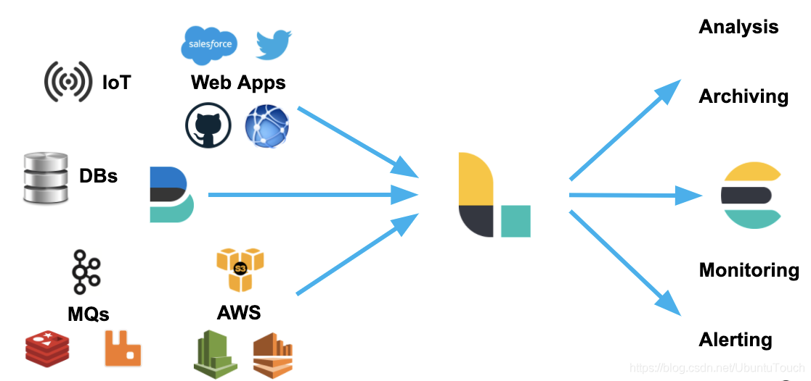
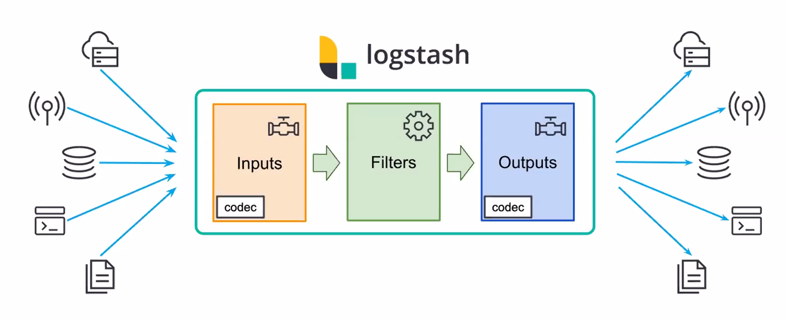
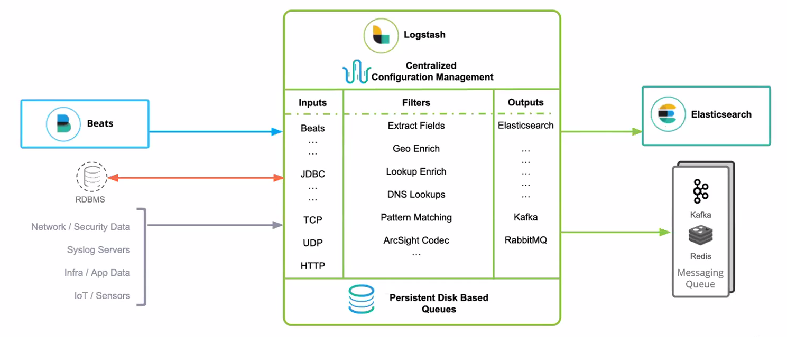

# logstash 简介

> https://elasticstack.blog.csdn.net/article/details/105973985

> [Elastic 中国社区官方博客, Logstash专栏](https://blog.csdn.net/ubuntutouch/category_9335275.html)

Logstash 是一个数据流引擎：

- 它是用于数据物流的开源流式 ETL（Extract-Transform-Load）引擎
- 在几分钟内建立数据流管道
- 具有水平可扩展及韧性且具有自适应缓冲
- 不可知的数据源
- 具有200多个集成和处理器的插件生态系统
- 使用 Elastic Stack 监视和管理部署

## logstash 和 filebeat 的关系

> [logstash 和filebeat 是什么关系?](https://www.zhihu.com/question/54058964)

logstash 是跑在 jvm 上的，资源消耗较大，所以作者又用 golang 写了一个功能较少但是资源消耗也小的轻量级的 `logstash-forwarder`。
之后作者加入 elastic 公司，该公司还收购了另一个开源项目 packetbeat，而这个项目就是使用 golang 开发的，有整个团队，
所以 elastic 公司干脆把 `logstash-forwarder` 的开发工作也合并到同一个 golang 团队来搞，于是新的项目就叫 filebeat 了。

## 数据摄入

它可以摄入日志，文件，数据库或者网路真实数据。经过 Logstash 的处理，变为可以使用的 Web Apps 可以消费的数据，也可以存储于数据中心，或变为其它的流式数据。

- Logstash 可以很方便地和 Beats一起合作，这也是被推荐的方法
- Logstash 也可以和那些著名的云厂商的服务一起合作处理它们的数据
- 它也可以和最为同样的信息消息队列，比如 redis 或 kafka 一起协作
- Logstash 也可以使用 JDBC 来访问 RDMS 数据
- 它也可以和 IoT 设备一起处理它们的数据
- Logstash 不仅仅可以把数据传送到 Elasticsearch，而且它还可以把数据发送至很多其它的目的地，并作为它们的输入源做进一步的处理

---

## Logstash 是如何工作的

Logstash 包含3个主要部分： 输入（inputs），过滤器（filters）和输出（outputs）。 你必须定义这些过程的配置才能使用 Logstash，当然过滤器是可选的。过滤器可以对数据源的数据进行分析，丰富，处理等等。这三个部分都是以插件(plugin)的方式运行, 你也可以自定义插件。

logstash 支持非常多的插件， 具体插件见下面的链接

- [Input plugins list](https://www.elastic.co/guide/en/logstash/current/input-plugins.html)

- [Output plugins list](https://www.elastic.co/guide/en/logstash/current/output-plugins.html)

- [Filter plugins list](https://www.elastic.co/guide/en/logstash/current/filter-plugins.html)

下图是常见的插件：

