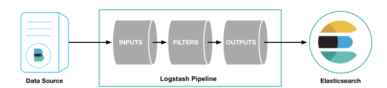

# 管道(pipeline)

Logstash 管道有两个必需插件，输入（inputs）和输出（ouputs），以及一个可选插件 filters。 输入插件使用源产生的数据，过滤器插件在您指定时修改数据，输出插件将数据写入目标。

---

## 输入插件

>  [Input plugins | Logstash Reference | Elastic](https://www.elastic.co/guide/en/logstash/current/input-plugins.html)

输入插件使Logstash可以读取特定的事件源。

---

## 过滤插件

> [Filter plugins | Logstash Reference | Elastic](https://www.elastic.co/guide/en/logstash/current/filter-plugins.html)

过滤器插件对事件执行中介处理。 通常根据事件的特征有条件地应用过滤器。

---

## 输出插件

> [Output plugins | Logstash Reference | Elastic](https://www.elastic.co/guide/en/logstash/current/output-plugins.html)

输出插件将事件数据发送到特定的目的地。 输出是事件管道中的最后阶段。

