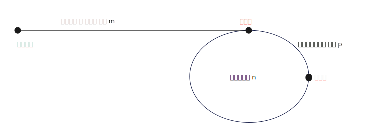

# 链表

单链表

双链表

循环链表

## 时间复杂度

| 操作  | 时间复杂度 | 说明       |
| --- | ----- | -------- |
| 查找  | O(n)  | -        |
| 插入  | O(1)  | 不考虑查找的过程 |
| 删除  | O(1)  | 不考虑查找的过程 |

## 面试题

### 反转单链表

> https://leetcode.com/problems/reverse-linked-list/

```cpp
struct ListNode {
    int value;
    ListNode* next;
};

class Solution {
public:
    ListNode* reverseList(ListNode* head) {

        ListNode* prev = nullptr;
        ListNode* next = nullptr;

        while (head) {
            next = head->next;
            head->next = prev;
            prev = head;
            head = next;
        }

        return prev;
    }
};
```

### 反转单链表相邻两个节点

> https://leetcode.com/problems/swap-nodes-in-pairs/
> 
> https://www.lintcode.com/problem/451/

```cpp
class Solution {
public:
    ListNode* swapPairs(ListNode* head) {
        if (!head || !head->next) {
            return head;
        }

        ListNode* node1 = nullptr;
        ListNode* node2 = nullptr;
        ListNode* lastNode1  = head;
        ListNode* newHead = head->next;

        while (head && head->next) {
            node1 = head;
            node2 = head->next;

            lastNode1->next = node2; //node1->next = node4
            lastNode1 = node1;

            head = node2->next; //head = node3
            node2->next = node1;
            node1->next = head; //node1->next = node3
        }

        return newHead;
    }
};
```

### 链表是否有环

> https://leetcode.com/problems/linked-list-cycle/
> 
> https://www.lintcode.com/problem/102/

- 方法1: 节点存 set，遍历同时查set，这样的话空间复杂度为 O(n)

- 方法2: 快慢指针(快指针一次走两步，慢指针一次走一步，如果相遇则有环)

- ```cpp
  class Solution {
  public:
      bool hasCycle(ListNode *head) {
          ListNode* fast = head;
          ListNode* slow = head;
  
          while (fast && fast->next && slow) {
              slow = slow->next;
              fast = fast->next->next;
              if (fast == slow) {
                  return true;
              }
          }
          return false;
      }
  };
  ```

### 找出带环链表中环的起点

> https://leetcode.com/problems/linked-list-cycle-ii/
> 
> https://www.lintcode.com/problem/103/
> 
> 解读: https://www.youtube.com/watch?v=kZP8Cij1fxk&ab_channel=HuifengGuan

- 方法1: 用 set 存储节点，这样的话空间复杂度为 O(n)

- 方法2: 仍借助上面的快慢指针方式

> 1. 快慢指针相遇，则相遇点必定在环中
> 
> 2. 设 链表起点到环起点的距离为 m， 环的长度为 n，在环上 p 距离相遇
> 
> 3. 相遇时快指针的路程是慢指针的2倍 m + k<sub>1</sub>n + p = 2(m + k<sub>2</sub>n + p) ,k<sub>1</sub>为快指针圈数， k<sub>2</sub>为慢指针圈数
> 
> 4. 简化后可得  (k<sub>1</sub>-2k<sub>2</sub>)n = m + p，可以得到 从 p 点移动距离 m 是整数倍的圈数
> 
> 5. 从链表起点移动到环起点距离是 m，从相遇点移动 m 也到环起点
>    
>    

```cpp
class Solution {
public:
    ListNode * detectCycle(ListNode * head) {
        if (!head || !head->next) {
            return nullptr;
        }

        ListNode* fast = head;
        ListNode* slow = head;

        while (fast && fast->next && slow) {
            slow = slow->next;
            fast = fast->next->next;
            if (slow == fast) {
                break;
            }
        }
        if (slow != fast) {
            return nullptr;
        }

        while (slow != head) {
            slow = slow->next;
            head = head->next;
        }

        return head;
    }
};
```

### 每 k 个节点一组翻转链表

> https://leetcode.com/problems/reverse-nodes-in-k-group/
