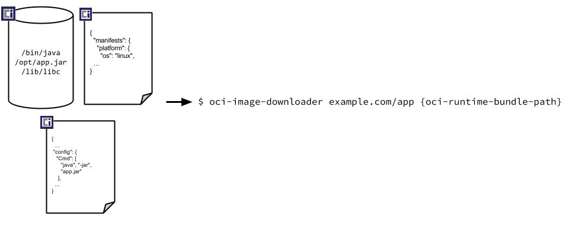

# OCI 镜像格式标准

> [opencontainers/image-spec · GitHub](https://github.com/opencontainers/image-spec/blob/main/spec.md)

此标准定义了OCI镜像格式由 manifest, image index(可选),一组 filesystem layers 和 配置 组成。

本规范的目标是创建可互操作的工具，用于构建、传输和准备要运行的容器镜像。

---

## 概述

在较高级别上，映像清单包含有关映像内容和依赖项的元数据，包括一个或多个文件系统层变更集档案的内容可寻址身份，这些档案将被解包以构成最终的可运行文件系统。 

映像配置包括应用程序参数、环境等信息。映像索引是更高级别的清单，它指向清单和描述符列表。 通常，这些清单可以提供图像的不同实现，可能因平台或其他属性而异。

一旦构建了 OCI 映像，就可以通过名称发现、下载、通过哈希验证、通过签名信任并解压缩到 OCI 运行时包中。

---

## The high-level components of the spec include:

- [Image Manifest](https://github.com/opencontainers/image-spec/blob/main/manifest.md) - 描述构成容器映像的组件的文档
- [Image Index](https://github.com/opencontainers/image-spec/blob/main/image-index.md) - an annotated index of image manifests 图像清单的注释索引
- [Image Layout](https://github.com/opencontainers/image-spec/blob/main/image-layout.md) - 表示镜像内容的文件系统布局
- [Filesystem Layer](https://github.com/opencontainers/image-spec/blob/main/layer.md) - 描述容器文件系统的变更集
- [Image Configuration](https://github.com/opencontainers/image-spec/blob/main/config.md) - 确定适合翻译成运行时包的图像的层顺序和配置的文档
- [Conversion](https://github.com/opencontainers/image-spec/blob/main/conversion.md) - 描述如何进行翻译的文件
- [Descriptor](https://github.com/opencontainers/image-spec/blob/main/descriptor.md) - 描述被引用内容的类型、元数据和内容地址的引用

Future versions of this specification may include the following OPTIONAL features:

- Signatures that are based on signing image content address
- Naming that is federated based on DNS and can be delegated

