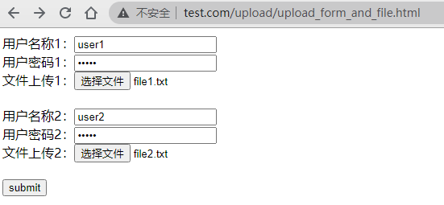

# 文件上传



## 上传请求

```http
POST /upload/upload_form_and_file.php HTTP/1.1
Host: www.test.com
Connection: keep-alive
Content-Length: 845
Cache-Control: max-age=0
Upgrade-Insecure-Requests: 1
Origin: http://www.test.com
Content-Type: multipart/form-data; boundary=----WebKitFormBoundaryJZ8Ay8xth0O6N4CK
User-Agent: Mozilla/5.0 (Windows NT 10.0; Win64; x64) AppleWebKit/537.36 (KHTML, like Gecko) Chrome/87.0.4280.141 Safari/537.36
Accept: text/html,application/xhtml+xml,application/xml;q=0.9,image/avif,image/webp,image/apng,*/*;q=0.8,application/signed-exchange;v=b3;q=0.9
Referer: http://www.test.com/upload/upload_form_and_file.html
Accept-Encoding: gzip, deflate
Accept-Language: zh-CN,zh-TW;q=0.9,zh;q=0.8

------WebKitFormBoundaryJZ8Ay8xth0O6N4CK
Content-Disposition: form-data; name="username1"

user1
------WebKitFormBoundaryJZ8Ay8xth0O6N4CK
Content-Disposition: form-data; name="password1"

pass1
------WebKitFormBoundaryJZ8Ay8xth0O6N4CK
Content-Disposition: form-data; name="filename1"; filename="file1.txt"
Content-Type: text/plain

file1
------WebKitFormBoundaryJZ8Ay8xth0O6N4CK
Content-Disposition: form-data; name="username2"

user2
------WebKitFormBoundaryJZ8Ay8xth0O6N4CK
Content-Disposition: form-data; name="password2"

pass2
------WebKitFormBoundaryJZ8Ay8xth0O6N4CK
Content-Disposition: form-data; name="filename2"; filename="file2.txt"
Content-Type: text/plain

file2
------WebKitFormBoundaryJZ8Ay8xth0O6N4CK
Content-Disposition: form-data; name="submit"

submit
------WebKitFormBoundaryJZ8Ay8xth0O6N4CK--
```

## 上面HTML页面

```html
<html>
<head>
<meta charset="utf-8">
<title>上传表单和文件</title>
</head>
<body>
<form action="upload_form_and_file.php" method="post" enctype="multipart/form-data">
    用户名称1：<input type='text' name='username1' ></br>
    用户密码1：<input type='password' name='password1'></br>
    文件上传1：<input type='file' name='filename1'></br><br>
    用户名称2：<input type='text' name='username2' ></br>
    用户密码2：<input type='password' name='password2'></br>
    文件上传2：<input type='file' name='filename2'></br></br>
    <input type='submit' name='submit' value='submit'>
</form>
</body>
</html>
```

## 上传PHP处理文件

```php
<html>
<head>
<meta charset="utf-8">
<title>上传结果</title>
</head>
<?php
if (true)
{
    echo "用户名称1: " . $_POST["username1"] . "<br>";
    echo "用户密码1: " . $_POST["password1"] . "<br>";
    echo "上传文件1: " . $_FILES["filename1"]["name"] . "<br>";
    echo "文件1类型: " . $_FILES["filename1"]["type"] . "<br>";
    echo "文件1大小: " . ($_FILES["filename1"]["size"] / 1024) . " kB<br>";
    move_uploaded_file($_FILES["filename1"]["tmp_name"], "upload_store/" . $_FILES["filename1"]["name"]);
    echo "文件1存储在: " . "upload_store/" . $_FILES["filename1"]["name"] . "<br><br>";

    echo "用户名称2: " . $_POST["username2"] . "<br>";
    echo "用户密码2: " . $_POST["password2"] . "<br>";
    echo "上传文件2: " . $_FILES["filename2"]["name"] . "<br>";
    echo "文件2类型: " . $_FILES["filename2"]["type"] . "<br>";
    echo "文件2大小: " . ($_FILES["filename2"]["size"] / 1024) . " kB<br>";
    move_uploaded_file($_FILES["filename2"]["tmp_name"], "upload_store/" . $_FILES["filename2"]["name"]);
    echo "文件2存储在: " . "upload_store/" . $_FILES["filename2"]["name"];
}
?>

</html>
```
