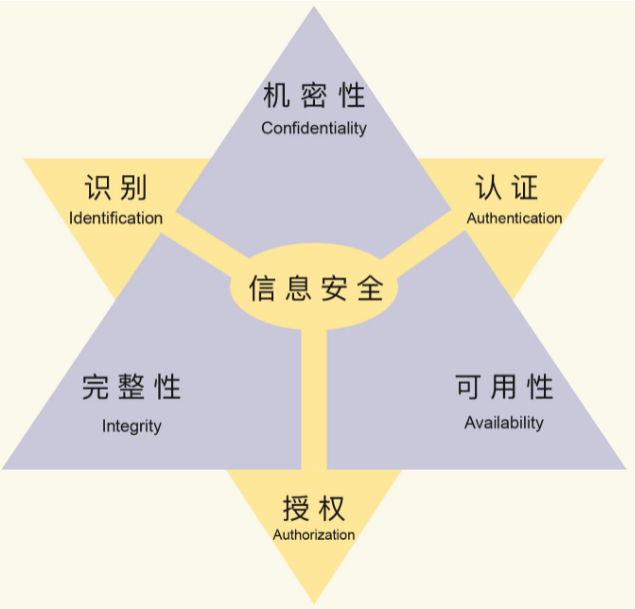

# 密码学基础

> [实用密码学-范学雷](https://time.geekbang.org/column/intro/100064801)
> 
> 密码学最好的书籍，当属Bruce Schneier 的《应用密码学：协议、算法与 C 源程序》。

密码学是研究如何在不安全的通道中安全的传递信息的学科。密码学的首要目的是隐藏信息的涵义，并不是隐藏信息的存在。

## 信息安全的六个基本需求

- 机密性(Confidentiality) - 数据未经授权，不得访问

- 完整性(Integrity) - 数据未经授权，不得更改

- 可用性(Availability) - 数据经过授权，可以访问

- 身份识别(Identification) - 身份如何呈现和表述

- 身份认证(Authentication) - 识别和验证身份的过程

- 授权管理(Authorization) - 对资源的访问权限，或者使用特权

这6个需求里, 前3个是信息安全的三要素(CIA), 后三个授权的过程。

---

## 密码学基础分支

密码学最基础的分支有三个，第一个是**单向散列函数**，第二个是**对称密码技术**，第三个是**非对称密码技术**。这三项基础技术的组合运用，诞生出了丰富的安全协议和体系，比如说数字证书、安全传输、区块链、数字货币等。使用密码学就可以处理上面的6个需求。

| 技术      | 解决的问题               |
| ------- | ------------------- |
| 单向散列函数  | 可以解决“完整性”问题         |
| 对称密码技术  | 可以解决“机密性”的问题        |
| 非对称密码技术 | 非对称密码技术可以解决授权和认证的问题 |

### 单向散列函数

单向散列函数既是一个单向函数，也是一个散列函数。它不仅要满足单向函数的要求，还要满足散列函数的要求。

#### 单向函数

单向函数（One-way Function）是正向计算容易，逆向运算困难的函数。

- 一个更实用的单向函数，正向计算会更容易，容易程度就是这个函数的**计算性能**；

- 一个更实用的单向函数，逆向运算会更困难，困难程度就是这个函数的**破解强度**。

一个实用的单向函数，计算性能和破解强度要均衡考量

#### 散列函数

散列函数（Hash Function）是一个可以把任意大小的数据，转行成固定长度的数据的函数。

我们把转换后的数据，叫做散列值。**一个好的散列函数，它的散列值应该是均匀分布的**。如果不均匀则会遭受**碰撞攻击**。

**通常散列值越长，存在相同散列值的概率就越小，发生碰撞的可能性就越小**。

散列值的长度选择，应该是权衡性能后的结果。

#### 单向散列函数

单向散列函数既是一个单向函数，也是一个散列函数。它不仅要满足单向函数的要求，还要满足散列函数的要求。其中，最要紧的就是：

- 正向计算容易，**逆向运算困难**

- 运算结果均匀分布，**构造碰撞困难**

**雪崩效应**（Avalanche Effect）是密码学算法一个常见的特点，指的是输入数据的微小变换，就会导致输出数据的巨大变化。严格雪崩效应是雪崩效应的一个形式化指标，我们也常用来衡量均匀分布。**严格雪崩效应指的是，如果输入数据的一位反转，输出数据的每一位都有 50% 的概率会发生变化**。一个适用于密码学的单向散列函数，就要具有雪崩效应的特点，也就是说，如果一个单向散列函数具有雪崩效应，那么对于给定的数据，构造出一个新的、具有相同散列值的数据是困难的。

### 密码学的公开性与安全性

密码学算法的实现原理是通常公开的，可能会有人认为一些自行实现的不公开加密算法更安全，其实自行设计的算法根本不具备严格的数学模型， 很容易被攻破。公开的算法，经历了时间的考验反而更安全。

国密SM1和SM7的算法是不公开的，不公开的算法需要大量的数学家和工程师来验证检测才能保证其安全性。这里除了加密算法数学的理论上安全性，还有软件实现方法的安全性，二者是缺一不可的。

什么是好的加密算法呢？简单来说就是只能使用穷举法才能破解的算法。目前计算机的处理速度越来越快，某些密码学算法的数学基础可能受到挑战，现阶段安全的密码学算法，未来可能就不安全了。 对于算法应用者来说，确保目前使用的密码学算法是安全的就可以了，潜在也说明，应用者应该长期关注密码学算法的安全性，使用最安全 、 最合适的密码学算法。

### 信息熵与概率论

> https://www.zhihu.com/question/22178202

熵在信息论中代表随机变量不确定度的度量。

信息熵的三条性质：

- 单调性，即发生概率越高的事件，其所携带的信息熵越低。极端案例就是“太阳从东方升起”，因为为确定事件，所以不携带任何信息量。从信息论的角度，认为这句话没有消除任何不确定性。
- 非负性，即信息熵不能为负。这个很好理解，因为负的信息，即你得知了某个信息后，却增加了不确定性是不合逻辑的。
- 累加性，即多随机事件同时发生存在的总不确定性的量度是可以表示为各事件不确定性的量度的和。

本章节主要是围绕TLS来介绍密码学。
TLS中的算法分为4类，

- authentication (认证)算法
- key exchange(密钥交换)算法
- encryption(加密)算法
- message authentication code (消息认证码 简称MAC)算法 

### References

> https://www.bilibili.com/video/BV1tz4y197hm?from=search&seid=12387077708171018816