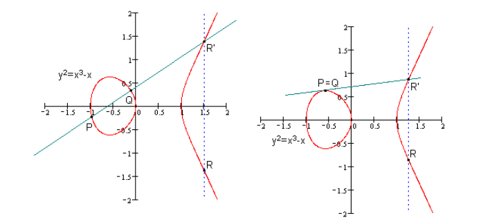

# ECC

ECC(Elliptic Curve Cryptography)椭圆曲线密码学,是一种基于椭圆曲线数学的公开密钥加密算法。

椭圆曲线的形状，并不是椭圆的。只是因为椭圆曲线的描述方程类似于计算一个椭圆周长的方程，故得名。

椭圆曲线的定义也要求曲线是非奇异的(即处处可导的)。

从上面看的到的椭圆曲线是连续的，这并不适合用于加密，我们必须把椭圆曲线变成离散的点。

为什么椭圆曲线为什么连续？是因为椭圆曲线上点的坐标，是实数的（也就是说前面讲到的椭圆曲线是定义在实数域上的），实数是连续的，导致了曲线的连续。因此，我们要把椭圆曲线定义在有限域上（顾名思义，有限域是一种只有由有限个元素组成的域）。

公开密钥算法总是要基于一个数学上的难题。比如RSA 依据的是：给定两个素数`p`、`q` 很容易相乘得到`n`，而对`n`进行因式分解却相对困难。那椭圆曲线上有什么难题呢？

考虑如下等式：
K=kG  [其中 K,G为Ep(a,b)上的点，k为小于n（n是点G的阶）的整数]
不难发现，给定k和G，根据加法法则，计算K很容易；但给定K和G，求k就相对困难了。
这就是椭圆曲线加密算法采用的难题。我们把点G称为基点（base point），k（k<n，n为基点G的阶）称为私钥（privte key），K称为公钥（public key)。

并不是所有的椭圆曲线都适合加密。<mark>y2=x3+ax+b</mark> 是一类可以用来加密的椭圆曲线，也是最为简单的一类。

ECC的主要优势是它相比RSA算法使用较小的密钥长度并提供相同等级的安全性,有研究表示160位的椭圆密钥与1024位的RSA密钥安全性相同。
ECC的另一个优势是可以定义群之间的双线性映射，基于Weil对或是Tate对；
双线性映射已经在密码学中发现了大量的应用，例如基于身份的加密。

椭圆曲线密码学的许多形式有稍微的不同，所有的都依赖于被广泛承认的解决椭圆曲线离散对数问题的困难性上，对应有限域上椭圆曲线的群

### 常见曲线

| 名称                                                     | 简称    | 简介                                    | 曲线方程                                                    |
| ------------------------------------------------------ | ----- | ------------------------------------- | ------------------------------------------------------- |
| [x25519](https://en.wikipedia.org/wiki/Curve25519)     | -     | X25519 是 Curve25519 作为DH函数的名称         | y2 = x3 + 486662x2 + x |
| [x448](https://en.wikipedia.org/wiki/Curve448)         | -     | Curve448用于ECDH时的名称                    | -                                                       |
| [Ed25519](https://en.wikipedia.org/wiki/EdDSA#Ed25519) | -     | 用于EdDSA签名的曲线                          | -                                                       |
| [Ed448](https://en.wikipedia.org/wiki/EdDSA#Ed448)     | -     | 用于EdDSA签名曲线                           | -                                                       |
| prime192v1(secp192r1)                                  | P-192 |                                       | y2 = x3+ax+b                      |
| prime256v1(secp256r1)                                  | P-256 | 256-bit prime field Weierstrass curve | y2 = x3+ax+b                      |
| secp224r1                                              | P-224 |                                       |                                                         |
| secp384r1                                              | P-384 |                                       |                                                         |
| secp521r1                                              | P-521 |                                       |                                                         |
| secp256k1                                              | -     | 比特币使用的曲线                              |                                                         |
| SM2                                                    | -     | 国密SM2使用的曲线                            |                                                         |

### References

http://safecurves.cr.yp.to/

https://www.cryptosys.net/pki/eccrypto.html

https://en.wikipedia.org/wiki/Elliptic-curve_cryptography

[ECC加密算法入门介绍 | 巴比特](https://www.8btc.com/article/15089)

https://zhuanlan.zhihu.com/p/103665076