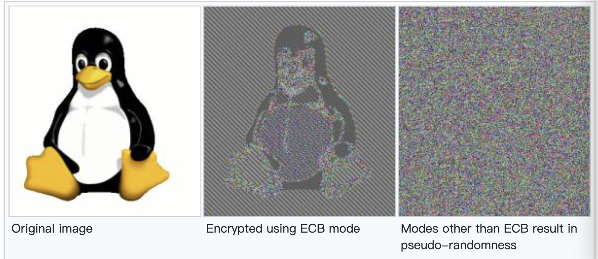

# 对称加密

## 对称加密算法类型

对称加密算法有两种类型，分别是`块密码算法`(block ciphers)和`流密码算法`(stream

ciphers)。

### 流密码算法

| 名称     | 密钥长度           | 说明                                                                      |
| ------ | -------------- | ----------------------------------------------------------------------- |
| RC4    | 可变长密钥，建议2048比特 | 已经证明不安全，详见[RC4](https://en.wikipedia.org/wiki/RC4#Security)             |
| ChaCha | 可变长密钥，建议256比特  | 目前比较安全,详见[ChaCha](https://en.wikipedia.org/wiki/Salsa20#ChaCha_variant) |

流密码算法之所以称为流密码算法， 就在于每次 XOR 运算的时候，是连续对数据流进行运算的一种算法，每次处理的数据流大小一般是一个字节。流密码算法可以并行处理，运算速度非常快。

### 块密码算法

#### 分组模式

##### ECB(Electronic codebook)

电码本模式是将待处理信息被分为大小合适的分组，然后分别对每一分组独立进行加密或解密处理。具有操作简单，易于实现的特点。同时由于其分组的独立性，利于实现并行处理，并且能很好地防止误差传播。

另一方面由于所有分组的加密方式一致，明文中的重复内容会在密文中有所体现，因此难以抵抗统计分析攻击。因此，ECB模式一般只适用于小数据量的字符信息的安全性保护。

##### CBC(Cipher block chaining)

##### CTR(Counter)

##### GCM(Galois/counter)

##### CCM(Counter with cipher block chaining message authentication code)

