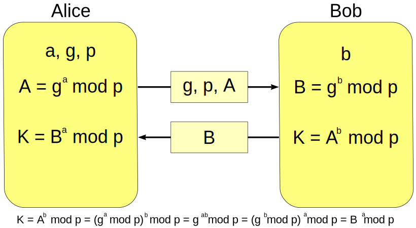

# DH算法

`DH` 是 Diffie-Hellman 的首字母缩写。是一种密钥协商算法，是 Whitefield Diffie 与 Martin Hellman 在1976年提出了一个奇妙的密钥交换协议。它的巧妙之处在于双方最终协商的共同的密钥不会通过网络传输，而是双方各自计算出来的。

----

### DH原理

- 发送方选择两个大素数 `g` 和 `p`，这两个数不是保密的；
- 发送方选择一个大随机整数`a`，计算 <mark>`A` = ga mod p</mark>，发送`g` 、`p`、`A`给接收方；
- 接收方选择一个大随机整数`b`，计算 <mark>`B` = gb mod p</mark>，发送`B`给发送方；

 确定最终密钥：

- 发送方密钥为 <mark>`k1` = B^a mod p</mark>，
- 接收方密钥为 <mark>`k2` = A^b mod p</mark>。

最终`k1 == k2`, 其他人可以知道`g`、 `p`、 `A`、`B`， 但是他们不能计算出密钥，除非他们能恢复`a`和`b`。

缺点：不能抵御中间人攻击。
解决方法：使用认证的方法，确保`A` 、`B`可信。

---

### Reference

https://www.cnblogs.com/HKUI/p/12865277.html

https://www.cnblogs.com/fishou/p/4206451.html

https://blog.csdn.net/mrpre/article/details/52608867

https://blog.csdn.net/xiangguiwang/article/details/74013733

https://en.wikipedia.org/wiki/Diffie%E2%80%93Hellman_key_exchange