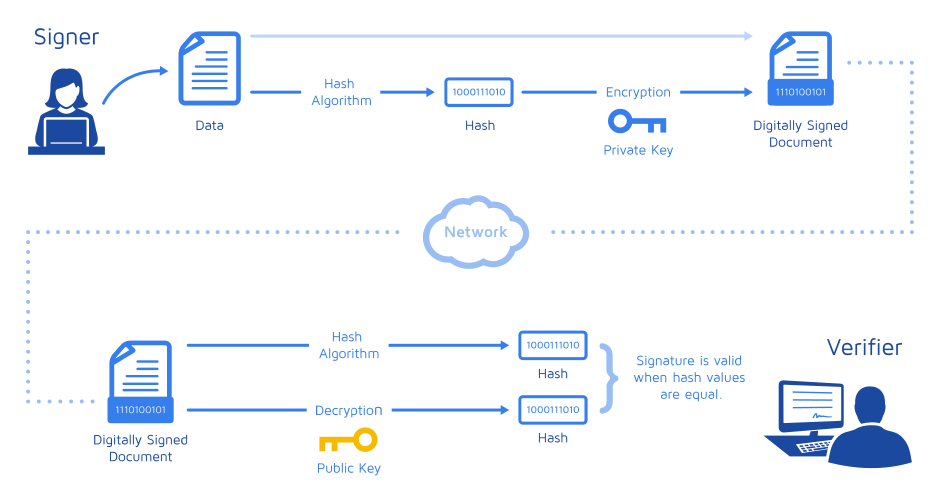

# 数字签名

> [What is a Digital Signature? - David Youd](http://www.youdzone.com/signature.html)
> 
> [简单理解数字签名和验签 - 华为云](https://www.huaweicloud.com/articles/5dd19708ef718e857a722dcf745c1b21.html)

数字签名（又称为`公钥数字签名`、`电子签章`）是一种使用了公钥加密领域实现的用于鉴别数字信息的方法。

一套数字签名通常定义两种互补的运算，一个用于签名，另一个用于验证。<mark>数字签名是非对称密钥加密技术与数字摘要技术的应用</mark>。

### 签名和验签

服务器有两把钥匙一把公钥、一把私钥。客户端想和服务器达到秘密交流就需要服务器特有的公钥进行加密这样别人就不知道你发送的是什么，服务器收到客户端的信息后用特有的私钥解密就能看到信息内容。服务器要给客户端返回消息，这时候就会使用Hash函数对信息生成一个摘要(Digest)，用私钥对摘要加密生成数字签名(Signature),将消息和数字签名一起返回给客户端。客户端收到返回后，先使用公钥对数字签名解密得到摘要，再将信息通过Hash函数生成摘要，只要这两个摘要相同则证明该信息是中途没有被篡改过的。

值得注意的是，这样也容易出现信息泄漏。因为数字签名一被更换也就不能确定是否为真实的信息发起者发出的信息了。所以为了证明服务器的数字签名是否为真实的，服务器需要将公钥进行认证，会有一个数字证书，这个证书证明了这个公钥就是这台服务器独有的。服务器返回消息的时候会将数字证书一起发送过来，客户端接收到后就可以使用证书中心声明的公钥去解开数字证书来得到这台服务器的公钥。就能判断是否为真实的公钥了。然后客户端就可以使用证书中的服务器公钥，对信息进行加密，然后与服务器交换加密信息。




---

### 使用 OpenSSL 命令

> [cryptography - Digital signature for a file using openssl - Stack Overflow](https://stackoverflow.com/questions/10782826/digital-signature-for-a-file-using-openssl)

#### 私钥和公钥生成

下面是使用 RSA 算法生成的私钥和公钥的例子

```bash
# 生成 RSA 私钥（2048位）
openssl genrsa -out privatekey.pem 2048
# 生成 RSA 公钥
openssl rsa -in privatekey.pem -pubout -out publickey.pem
```

现实应用中我们更多看到的是私钥和证书, 证书是通过私钥生成的，公钥是证书的一部分可以从证书中导出

```bash
# 使用私钥生成证书
openssl req -new -x509 -days 365 -key privatekey.pem -out certificate.pem -subj '/C=CN/ST=Beijing/O=LubinLew'
# 从证书中导出公钥
openssl x509 -in certificate.pem -pubkey -noout > publickey.pem
```

#### 签名

下面的例子是对 `data.txt`进行签名

```bash
openssl dgst -sha256 data.txt > hash
openssl rsautl -sign -inkey privatekey.pem -keyform PEM -in hash > signature
```

#### 验签

```bash
openssl rsautl -verify -inkey publickey.pem -pubin -keyform PEM -in signature
```

### 使用 OpenSSL 编码

> https://www.openssl.org/docs/man1.0.2/man3/RSA_sign.html
> 
> https://www.openssl.org/docs/man1.0.2/man3/DSA_sign.html
> 
> https://www.openssl.org/docs/man1.1.0/man3/ECDSA_sign.html

#### 签名(RSA)

> [intelRSD/RMM/utils/tools/sign_image at 1.2.1 · intel/intelRSD · GitHub](https://github.com/intel/intelRSD/tree/1.2.1/RMM/utils/tools/sign_image)

#### 验签(RSA)

> [xbps/verifysig.c at master · void-linux/xbps · GitHub](https://github.com/void-linux/xbps/blob/master/lib/verifysig.c)
