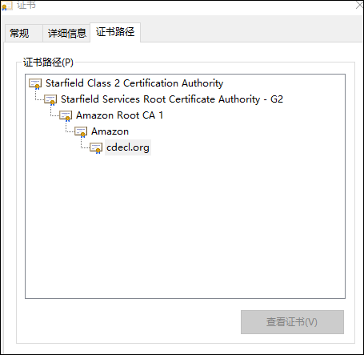

# 证书链

下图是由根证书，中间证书(可能多个)，用户证书组成一条完整证书信任链。

只有当整个证书信任链上的各个证书都有效时，浏览器才会认定用户证书是有效和受信任的。

而证书链文件是指除了用户证书以外中间证书和根证书组成的证书文件称之为证书链文件。

证书链文件是证书部署和验证证书是否可信环节中最重要的组成部分。

## 根证书

是受信任CA证书颁发机构给自己颁发的证书,是信任链的起始点。浏览器判断根证书是否受信任主要是通过检索浏览器的根证书库可信任列表里是否存在。如果存在浏览器就会信任该根证书。目前有的浏览器会自建根证书库，例如火狐浏览器，有的浏览器会使用其他浏览器的根证书库或者调用操作系统的根证书库，例如谷歌浏览器。根证书信息查看可以通过点击根证书后查看证书信息后显示根证书的颁发者以及有效期等信息如下图所示：

## 中间证书

中间证书是根证书颁发机构CA对中间证书颁发机构的公钥进行数字签名得到的证书。
中间证书的作用主要是为了保护根证书。
因为如果直接采用根证书签发证书，一旦发生根证书泄露，将造成极大的安全问题。
中间证书可以不止一个，目前我们经常看到有两级中间证书的，原则上中间证书层数越多，根证书越安全。
但是一般情况下最多也不超过2级。

## 用户证书

用户证书是由中间证书CA签发给用户的证书。用户证书由中间证书证明可信。
用户证书是浏览器上实际体现和使用的证书。
用户证书可以通过点击小锁后查看到该证书颁发给哪个域名或者ip，证书有效期，颁发机构等信息。

https://www.anxinssl.com/9801.html