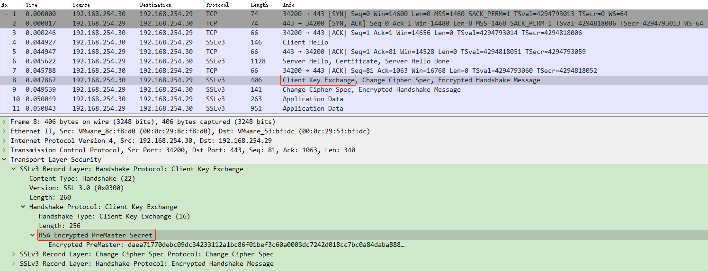
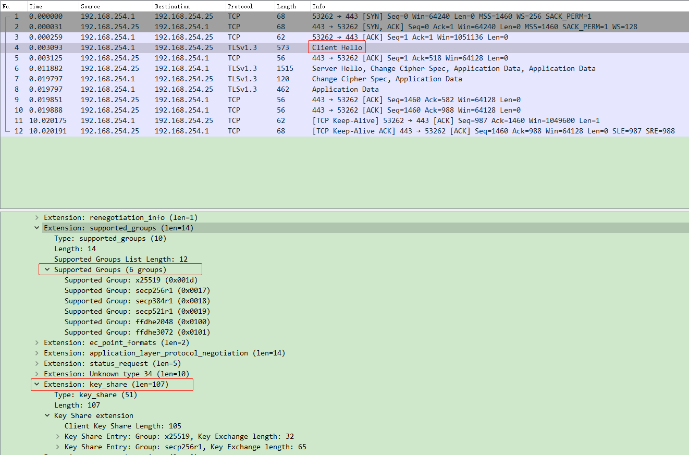
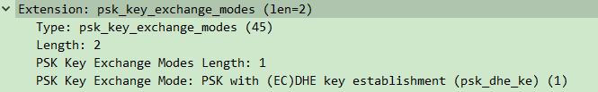

# TLS v1.3

本文介绍TLS协议的v1.3版本。 TLS协议允许客户端和服务器在 防窃听、防篡改 和 防消息伪造 的环境下通过互联网进行通信。

---

# 1. 简介(Introduction)

TLS协议的主要目标是为两个通信端(peer)提供一个加密的通道(channel)，底层传输的唯一要求是可靠、有序的数据流。

**加密通道提供以下安全属性**：

- 认证(Authentication): 通道的服务器端始终需要经过身份验证； 客户端可选地进行身份验证。
  认证可以通过非对称加密算法(例如RSA) 、
  椭圆曲线数字签名算法(ECDSA: Elliptic Curve Digital Signature Algorithm)
  爱德华曲线数字签名算法(EdDSA: Edwards-Curve Digital Signature Algorithm) 
  或者 对称预共享密钥(PSK: pre-shared key)

- 保密(Confidentiality): 加密通道建立后发送的数据仅对端点可见。  
  TLS 不会隐藏它传输的数据的长度，但是端点能够填充 TLS 记录以隐藏长度来提高对流量分析技术的对抗能力。

- 完整(Integrity): 加密通道建立后，发送的数据被攻击者修改是肯定可以被发现的。

即使面网络被攻击者完全控制，这些属性也应该是真实的 如 [RFC3552](https://www.rfc-editor.org/rfc/rfc3552) 中所述。
更完整的安全属性相关的声明见 [Appendix E](https://www.rfc-editor.org/rfc/rfc8446.html#appendix-E) .

**TLS的两大构成组件**

- [握手协议](https://www.rfc-editor.org/rfc/rfc8446.html#section-4): 用于验证通信方、协商加密模式和参数并建立共享密钥材料。 
  
  握手协议旨在防止篡改； 如果连接没有受到攻击，主动攻击者不能强迫对端协商不同的参数。 

- [记录协议](https://www.rfc-editor.org/rfc/rfc8446.html#section-5): 它使用握手协议建立的参数来保护通信端点之间的流量。 
  
  记录协议将流量分成一系列记录，每个记录都使用流量密钥进行独立保护。

TLS 独立于应用程序协议,更高级别的协议可以透明地建立在 TLS 之上。 TLS 标准并没有指定协议如何通过 TLS 增加安全性； 如何启动 TLS 握手以及如何解释交换的身份验证证书，由运行在 TLS 之上的协议的设计者和实现者自行判断。

虽然 TLS 1.3 不直接与以前的版本兼容，但所有版本的 TLS 都包含一种版本控制机制，如果双方都支持，则允许客户端和服务器互操作地协商通用版本。

TLS 1.3 取代并废弃了先前版本的 TLS，包括 1.2 版 [RFC5246]。 它还废弃了 [RFC5077] 中定义的 TLS 票证机制，并将其替换为第 2.2 节中定义的机制。 由于 TLS 1.3 更改了密钥的派生方式，因此它更新了 [RFC5705]，如第 7.5 节所述。 它还改变了在线证书状态协议 (OCSP) 消息的承载方式，因此更新了 [RFC6066] 并废弃了 [RFC6961]，如第 4.4.2.1 节所述。

## 1.1 约定和术语(Conventions and Terminology)

本文中使用了以下术语:

| Terminology | Description                                                                                                                                | Remark |
| ----------- | ------------------------------------------------------------------------------------------------------------------------------------------ | ------ |
| client      | The endpoint initiating the TLS connection                                                                                                 |        |
| connection  | A transport-layer connection between two endpoints                                                                                         |        |
| endpoint    | Either the client or server of the connection                                                                                              |        |
| handshake   | An initial negotiation between client and server that<br/> establishes the parameters of their subsequent interactions<br/> within TLS.    |        |
| peer        | An endpoint. When discussing a particular endpoint, "peer"<br/> refers to the endpoint that is not the primary subject of<br/> discussion. |        |
| receiver    | An endpoint that is receiving records.                                                                                                     |        |
| sender      | An endpoint that is transmitting records                                                                                                   |        |
| server      | The endpoint that did not initiate the TLS connection                                                                                      |        |

## 1.2. TLS 1.3 与 TLS 1.2 的主要区别

以下是 TLS 1.2 和 TLS 1.3 之间主要功能差异的列表。 它并不详尽无遗，并且许多细微差别并未列出。

- 支持的对称加密算法列表已从所有被视为传统的算法中删除。 剩下的都是带有关联数据的身份验证加密 (AEAD) 算法。 密码套件概念已更改为将身份验证和密钥交换机制与记录保护算法（包括密钥长度）和要与密钥派生函数和握手消息身份验证代码 (MAC) 一起使用的散列分开。

- 添加了零往返时间 (0-RTT) 模式，以某些安全属性为代价，在连接设置时为某些应用程序数据节省了往返时间。

- 静态 RSA 和 Diffie-Hellman 密码套件已被删除； 所有基于公钥的密钥交换机制现在都提供前向保密。

- `ServerHello` 之后的所有握手消息现在都已加密。 新引入的 `EncryptedExtensions` 消息允许之前在 `ServerHello` 中以明文形式发送的各种扩展也可以享受机密性保护。

- 密钥派生函数已重新设计。 由于改进了密钥分离特性，新设计允许密码学家更轻松地进行分析。 基于 HMAC 的提取和扩展密钥派生函数 (HKDF) 用作底层原语。

- 握手状态机已经过显着重组，以更加一致并删除诸如 ChangeCipherSpec 之类的多余消息（除了中间盒兼容性需要时）

- 椭圆曲线算法现在在基本规范中，并且包括新的签名算法，例如 EdDSA。 TLS 1.3 删除了点格式协商，以支持每条曲线的单点格式。

- 进行了其他加密改进，包括更改 RSA 填充以使用 RSA 概率签名方案 (RSASSA-PSS)，以及取消压缩、数字签名算法 (DSA) 和自定义临时 Diffie-Hellman (DHE) 组。

- TLS 1.2 版本协商机制已被弃用，取而代之的是扩展中的版本列表。 这增加了与错误实施版本协商的现有服务器的兼容性。

- 带有和不带有服务器端状态的会话恢复以及早期 TLS 版本的基于 PSK 的密码套件已被单个新的 PSK 交换所取代。

- 参考已更新，以适当地指向 RFC 的更新版本（例如，RFC 5280 而不是 RFC 3280）。

## 1.3  Updates Affecting TLS 1.2

本文档定义了一些可选地影响 TLS 1.2 实现的更改，包括那些不支持 TLS 1.3 的更改：

- 版本降级保护机制在第 4.1.3 节中描述。

- RSASSA-PSS 签名方案在第 4.2.3 节中定义

- `supported_versions` ClientHello 扩展可用于协商要使用的 TLS 版本，优先于 ClientHello 的 legacy_version 字段。

- `signature_algorithms_cert` 扩展允许客户端指示它可以在 X.509 证书中验证哪些签名算法。

此外，本文档阐明了 TLS 早期版本的一些合规性要求； 见第 9.3 节。

---

## 2.  协议总览(Protocol Overview)

安全通道使用的加密参数由 TLS 握手协议产生。 客户端和服务器在第一次相互通信时使用 TLS 的这个子协议。
握手协议允许对端协商协议版本，选择加密算法，可选地相互验证，并建立共享的密钥材料。
握手完成后，对端使用已建立的密钥来保护应用层流量。

握手失败或其他协议错误会触发连接终止，可以向对端发送警告(alert)消息。

TLS 支持三种基本的秘钥协商模式:

- (EC)DHE (Diffie-Hellman over either finite fields or ellipticcurves)
- PSK-only
- PSK with (EC)DHE

```txt
       Client                                           Server

Key  ^ ClientHello
Exch | + key_share*
     | + signature_algorithms*
     | + psk_key_exchange_modes*
     v + pre_shared_key*       -------->
                                                  ServerHello  ^ Key
                                                 + key_share*  | Exch
                                            + pre_shared_key*  v
                                        {EncryptedExtensions}  ^  Server
                                        {CertificateRequest*}  v  Params
                                               {Certificate*}  ^
                                         {CertificateVerify*}  | Auth
                                                   {Finished}  v
                               <--------  [Application Data*]
     ^ {Certificate*}
Auth | {CertificateVerify*}
     v {Finished}              -------->
       [Application Data]      <------->  [Application Data]

+  表示在前面提到的消息中发送的值得注意的扩展。
*  表示不总是发送的可选的或依赖于情况的消息或扩展。
{} 表示使用密钥保护的消息。
[] 表示使用密钥保护的数据。
```

握手的过程可以分为3个阶段(如上图所示)

- 秘钥交换(Key Exchange): 建立共享密钥材料并选择加密参数, 此阶段之后的所有内容都已加密。

- 服务器参数(Server Parameters): 建立其他握手参数(例如是否要认证客户端, 应用程序协议支持等)

- 身份认证(Authentication): 对服务端进行认证(客户端认证可选) 并提供密钥确认和握手完整性认证。

在秘钥交换阶段, 客户端发送的 `ClientHello` 消息中包含一个随机数(ClientHello.random); 

其中含有协议版本和对称密码 list 或者 HKDF哈希对; 或者是一组 Diffie-Hellman key
   shares (在 `key_share` 扩展中), 一组  pre-shared key labels (在 `pre_shared_key` 扩展中)
   extension), 或者同时存在; and potentially additional extensions.
   Additional fields and/or messages may also be present for middlebox
   compatibility.

服务端处理 `ClientHello` 消息, 决定该条连接使用什么密码参数;
然后发送 `ServerHello` 消息, 告知客户端选择使用什么密码参数.

结合 `ClientHello` 和 `ServerHello` 消息就能得出共享秘钥.
If (EC)DHE key establishment is in use, 那么` ServerHello` 将会带有 `key_share` 扩展,其中有服务端的临时 Diffie-Hellman 共享(share)

 the server's share MUST  be in the same group as one of the client's shares.

If PSK key  establishment is in use, 那么 `ServerHello` 将带有 `pre_shared_key` 扩展来指示客户端提供的哪个PSK被服务端选中 .

Note that implementations can use (EC)DHE and PSK  together, in which case both extensions will be supplied.

服务端发送2个消息来建立 Server Parameters:

- EncryptedExtensions:  该消息用来响应 `ClientHello` 消息的扩展(指的是不影响密码参数的扩展), 除了特定于单个证书的那些。

extensions that are  not required to determine the cryptographic parameters, other than
      those that are specific to individual certificates.

- CertificateRequest:  如果希望对客户端也做基于证书的认证就像客户端发送该消息, 否则就不发

最后, 客户端和服务端交换了认证消息。

TLS  uses the same set of messages every time that certificate-based authentication is needed.  (PSK-based authentication happens as a
   side effect of key exchange.)  Specifically:

- Certificate:  The certificate of the endpoint and any per-certificate
  extensions.  This message is omitted by the server if not
  authenticating with a certificate and by the client if the server
  did not send CertificateRequest (thus indicating that the client
  should not authenticate with a certificate).  Note that if raw
  public keys [[RFC7250](https://www.rfc-editor.org/rfc/rfc7250 ""Using Raw Public Keys in Transport Layer Security (TLS) and Datagram Transport Layer Security (DTLS)"")] or the cached information extension
  [[RFC7924](https://www.rfc-editor.org/rfc/rfc7924 ""Transport Layer Security (TLS) Cached Information Extension"")] are in use, then this message will not contain a
  certificate but rather some other value corresponding to the
  server's long-term key.  [[Section 4.4.2](https://www.rfc-editor.org/rfc/rfc8446.html#section-4.4.2)]

- CertificateVerify:  A signature over the entire handshake using the
  private key corresponding to the public key in the Certificate
  message.  This message is omitted if the endpoint is not
  authenticating via a certificate.  [[Section 4.4.3](https://www.rfc-editor.org/rfc/rfc8446.html#section-4.4.3)]

- Finished:  A MAC (Message Authentication Code) over the entire
  handshake.  This message provides key confirmation, binds the
  endpoint's identity to the exchanged keys, and in PSK mode also
  authenticates the handshake.  [[Section 4.4.4](https://www.rfc-editor.org/rfc/rfc8446.html#section-4.4.4)]
  
  Upon receiving the server's messages, the client responds with its
   Authentication messages, namely Certificate and CertificateVerify (if
   requested), and Finished.
  
  到此，握手就结束了, and the client and server
   derive the keying material required by the record layer to exchange
   application-layer data protected through authenticated encryption.
   Application Data MUST NOT be sent prior to sending the Finished
   message, except as specified in [Section 2.3](https://www.rfc-editor.org/rfc/rfc8446.html#section-2.3).  Note that while the
   server may send Application Data prior to receiving the client's
   Authentication messages, any data sent at that point is, of course,
   being sent to an unauthenticated peer.

## 2.1.  Incorrect DHE Share

如果客户端没有提供足够的 `key_share` 扩展（例如，它只包括服务器不接受或不支持的 DHE 或 ECDHE 组），则服务器使用 `HelloRetryRequest` 纠正不匹配，客户端需要使用适当的重新启动握手 `key_share` 扩展，如图 2 所示。如果没有可以协商的通用密码参数，服务器必须以适当的警报中止握手。

```txt
          Client                                        Server

        ClientHello
        + key_share             -------->
                                                  HelloRetryRequest
                                <--------               + key_share
        ClientHello
        + key_share             -------->
                                                        ServerHello
                                                        + key_share
                                              {EncryptedExtensions}
                                              {CertificateRequest*}
                                                     {Certificate*}
                                               {CertificateVerify*}
                                                         {Finished}
                                <--------       [Application Data*]
        {Certificate*}
        {CertificateVerify*}
        {Finished}              -------->
        [Application Data]      <------->        [Application Data]
```

Note: The handshake transcript incorporates the initial ClientHello/HelloRetryRequest exchange; 

it is not reset with the  new ClientHello.
TLS also allows several optimized variants of the basic handshake, as  described in the following sections.

## 2.2 Resumption and Pre-Shared Key (PSK)

Although TLS PSKs can be established out of band, PSKs can also be
   established in a previous connection and then used to establish a new
   connection ("session resumption" or "resuming" with a PSK).  Once a
   handshake has completed, the server can send the client a PSK
   identity that corresponds to a unique key derived from the initial
   handshake (see [Section 4.6.1](https://www.rfc-editor.org/rfc/rfc8446.html#section-4.6.1)).  The client can then use that PSK
   identity in future handshakes to negotiate the use of the associated
   PSK.  If the server accepts the PSK, then the security context of the
   new connection is cryptographically tied to the original connection
   and the key derived from the initial handshake is used to bootstrap
   the cryptographic state instead of a full handshake.  In TLS 1.2 and
   below, this functionality was provided by "session IDs" and "session
   tickets" [[RFC5077](https://www.rfc-editor.org/rfc/rfc5077 ""Transport Layer Security (TLS) Session Resumption without Server-Side State"")].  Both mechanisms are obsoleted in TLS 1.3.
   PSKs can be used with (EC)DHE key exchange in order to provide
   forward secrecy in combination with shared keys, or can be used
   alone, at the cost of losing forward secrecy for the application
   data.

```txt
       Client                                         Server

Initial Handshake:
       ClientHello
       + key_share               -------->
                                                       ServerHello
                                                       + key_share
                                             {EncryptedExtensions}
                                             {CertificateRequest*}
                                                    {Certificate*}
                                              {CertificateVerify*}
                                                        {Finished}
                                 <--------     [Application Data*]
       {Certificate*}
       {CertificateVerify*}
       {Finished}                -------->
                                 <--------      [NewSessionTicket]
       [Application Data]        <------->      [Application Data]


Subsequent Handshake:
       ClientHello
       + key_share*
       + pre_shared_key          -------->
                                                       ServerHello
                                                  + pre_shared_key
                                                      + key_share*
                                             {EncryptedExtensions}
                                                        {Finished}
                                 <--------     [Application Data*]
       {Finished}                -------->
       [Application Data]        <------->      [Application Data]
```

As the server is authenticating via a PSK, it does not send a
   Certificate or a CertificateVerify message.  When a client offers
   resumption via a PSK, it SHOULD also supply a "key_share" extension
   to the server to allow the server to decline resumption and fall back
   to a full handshake, if needed.  The server responds with a
   "pre_shared_key" extension to negotiate the use of PSK key
   establishment and can (as shown here) respond with a "key_share"
   extension to do (EC)DHE key establishment, thus providing forward
   secrecy.

When PSKs are provisioned out of band, the PSK identity and the KDF
   hash algorithm to be used with the PSK MUST also be provisioned.
   Note:  When using an out-of-band provisioned pre-shared secret, a
      critical consideration is using sufficient entropy during the key
      generation, as discussed in [[RFC4086](https://www.rfc-editor.org/rfc/rfc4086 ""Randomness Requirements for Security"")].  Deriving a shared secret
      from a password or other low-entropy sources is not secure.  A
      low-entropy secret, or password, is subject to dictionary attacks
      based on the PSK binder.  The specified PSK authentication is not
      a strong password-based authenticated key exchange even when used
      with Diffie-Hellman key establishment.  Specifically, it does not
      prevent an attacker that can observe the handshake from performing
      a brute-force attack on the password/pre-shared key.

## 2.3 0-RTT Data

When clients and servers share a PSK (either obtained externally or  via a previous handshake), 

TLS 1.3 allows clients to send data on the  first flight ("early data").  

The client uses the PSK to authenticate  the server and to encrypt the early data.
 As shown in Figure 4, the 0-RTT data is just added to the 1-RTT handshake in the first flight.  

The rest of the handshake uses the  same messages as for a 1-RTT handshake with PSK resumption.

```txt
Client                                               Server

ClientHello
+ early_data
+ key_share*
+ psk_key_exchange_modes
+ pre_shared_key
(Application Data*)     -------->
                                                ServerHello
                                           + pre_shared_key
                                               + key_share*
                                      {EncryptedExtensions}
                                              + early_data*
                                                 {Finished}
                        <--------       [Application Data*]
(EndOfEarlyData)
{Finished}              -------->
[Application Data]      <------->        [Application Data]
```

IMPORTANT NOTE: The security properties for 0-RTT data are weaker
   than those for other kinds of TLS data.  Specifically:

1. This data is not forward secret, as it is encrypted solely under
   keys derived using the offered PSK.
2. There are no guarantees of non-replay between connections.
   Protection against replay for ordinary TLS 1.3 1-RTT data is
   provided via the server's Random value, but 0-RTT data does not
   depend on the ServerHello and therefore has weaker guarantees.
   This is especially relevant if the data is authenticated either
   with TLS client authentication or inside the application
   protocol.  The same warnings apply to any use of the
   early_exporter_master_secret.
   0-RTT data cannot be duplicated within a connection (i.e., the server
   will not process the same data twice for the same connection), and an
   attacker will not be able to make 0-RTT data appear to be 1-RTT data
   (because it is protected with different keys).  [Appendix E.5](https://www.rfc-editor.org/rfc/rfc8446.html#appendix-E.5) contains
   a description of potential attacks, and [Section 8](https://www.rfc-editor.org/rfc/rfc8446.html#section-8) describes
   mechanisms which the server can use to limit the impact of replay.

----

# 3. Presentation Language

   This document deals with the formatting of data in an external
   representation.  The following very basic and somewhat casually
   defined presentation syntax will be used.

[3.1](https://www.rfc-editor.org/rfc/rfc8446.html#section-3.1).  Basic Block Size

   The representation of all data items is explicitly specified.  The
   basic data block size is one byte (i.e., 8 bits).  Multiple-byte data
   items are concatenations of bytes, from left to right, from top to
   bottom.  From the byte stream, a multi-byte item (a numeric in the
   following example) is formed (using C notation) by:
      value = (byte[0] << 8*(n-1)) | (byte[1] << 8*(n-2)) |
              ... | byte[n-1];
   This byte ordering for multi-byte values is the commonplace network
   byte order or big-endian format.

[3.2](https://www.rfc-editor.org/rfc/rfc8446.html#section-3.2).  Miscellaneous

   Comments begin with "/*" and end with "*/".
   Optional components are denoted by enclosing them in "[[ ]]" (double
   brackets).
   Single-byte entities containing uninterpreted data are of
   type opaque.
   A type alias T' for an existing type T is defined by:
      T T';

[3.3](https://www.rfc-editor.org/rfc/rfc8446.html#section-3.3).  Numbers

   The basic numeric data type is an unsigned byte (uint8).  All larger
   numeric data types are constructed from a fixed-length series of
   bytes concatenated as described in [Section 3.1](https://www.rfc-editor.org/rfc/rfc8446.html#section-3.1) and are also unsigned.
   The following numeric types are predefined.
      uint8 uint16[2];
      uint8 uint24[3];
      uint8 uint32[4];
      uint8 uint64[8];
   All values, here and elsewhere in the specification, are transmitted
   in network byte (big-endian) order; the uint32 represented by the hex
   bytes 01 02 03 04 is equivalent to the decimal value 16909060.

[3.4](https://www.rfc-editor.org/rfc/rfc8446.html#section-3.4).  Vectors

   A vector (single-dimensioned array) is a stream of homogeneous data
   elements.  The size of the vector may be specified at documentation
   time or left unspecified until runtime.  In either case, the length
   declares the number of bytes, not the number of elements, in the
   vector.  The syntax for specifying a new type, T', that is a fixed-
   length vector of type T is
      T T'[n];
   Here, T' occupies n bytes in the data stream, where n is a multiple
   of the size of T.  The length of the vector is not included in the
   encoded stream.

   In the following example, Datum is defined to be three consecutive
   bytes that the protocol does not interpret, while Data is three
   consecutive Datum, consuming a total of nine bytes.
      opaque Datum[3];      /* three uninterpreted bytes */
      Datum Data[9];        /* three consecutive 3-byte vectors */
   Variable-length vectors are defined by specifying a subrange of legal
   lengths, inclusively, using the notation <floor..ceiling>.  When
   these are encoded, the actual length precedes the vector's contents
   in the byte stream.  The length will be in the form of a number
   consuming as many bytes as required to hold the vector's specified
   maximum (ceiling) length.  A variable-length vector with an actual
   length field of zero is referred to as an empty vector.
      T T'<floor..ceiling>;
   In the following example, "mandatory" is a vector that must contain
   between 300 and 400 bytes of type opaque.  It can never be empty.
   The actual length field consumes two bytes, a uint16, which is
   sufficient to represent the value 400 (see [Section 3.3](https://www.rfc-editor.org/rfc/rfc8446.html#section-3.3)).  Similarly,
   "longer" can represent up to 800 bytes of data, or 400 uint16
   elements, and it may be empty.  Its encoding will include a two-byte
   actual length field prepended to the vector.  The length of an
   encoded vector must be an exact multiple of the length of a single
   element (e.g., a 17-byte vector of uint16 would be illegal).
      opaque mandatory<300..400>;
            /* length field is two bytes, cannot be empty */
      uint16 longer<0..800>;
            /* zero to 400 16-bit unsigned integers */

[3.5](https://www.rfc-editor.org/rfc/rfc8446.html#section-3.5).  Enumerateds

   An additional sparse data type, called "enum" or "enumerated", is
   available.  Each definition is a different type.  Only enumerateds of
   the same type may be assigned or compared.  Every element of an
   enumerated must be assigned a value, as demonstrated in the following
   example.  Since the elements of the enumerated are not ordered, they
   can be assigned any unique value, in any order.
      enum { e1(v1), e2(v2), ... , en(vn) [[, (n)]] } Te;
   Future extensions or additions to the protocol may define new values.
   Implementations need to be able to parse and ignore unknown values
   unless the definition of the field states otherwise.

   An enumerated occupies as much space in the byte stream as would its
   maximal defined ordinal value.  The following definition would cause
   one byte to be used to carry fields of type Color.
      enum { red(3), blue(5), white(7) } Color;
   One may optionally specify a value without its associated tag to
   force the width definition without defining a superfluous element.
   In the following example, Taste will consume two bytes in the data
   stream but can only assume the values 1, 2, or 4 in the current
   version of the protocol.
      enum { sweet(1), sour(2), bitter(4), (32000) } Taste;
   The names of the elements of an enumeration are scoped within the
   defined type.  In the first example, a fully qualified reference to
   the second element of the enumeration would be Color.blue.  Such
   qualification is not required if the target of the assignment is well
   specified.
      Color color = Color.blue;     /* overspecified, legal */
      Color color = blue;           /* correct, type implicit */
   The names assigned to enumerateds do not need to be unique.  The
   numerical value can describe a range over which the same name
   applies.  The value includes the minimum and maximum inclusive values
   in that range, separated by two period characters.  This is
   principally useful for reserving regions of the space.
      enum { sad(0), meh(1..254), happy(255) } Mood;

[3.6](https://www.rfc-editor.org/rfc/rfc8446.html#section-3.6).  Constructed Types

   Structure types may be constructed from primitive types for
   convenience.  Each specification declares a new, unique type.  The
   syntax used for definitions is much like that of C.
      struct {
          T1 f1;
          T2 f2;
          ...
          Tn fn;
      } T;
   Fixed- and variable-length vector fields are allowed using the
   standard vector syntax.  Structures V1 and V2 in the variants example
   ([Section 3.8](https://www.rfc-editor.org/rfc/rfc8446.html#section-3.8)) demonstrate this.

   The fields within a structure may be qualified using the type's name,
   with a syntax much like that available for enumerateds.  For example,
   T.f2 refers to the second field of the previous declaration.

[3.7](https://www.rfc-editor.org/rfc/rfc8446.html#section-3.7).  Constants

   Fields and variables may be assigned a fixed value using "=", as in:
      struct {
          T1 f1 = 8;  /* T.f1 must always be 8 */
          T2 f2;
      } T;

[3.8](https://www.rfc-editor.org/rfc/rfc8446.html#section-3.8).  Variants

   Defined structures may have variants based on some knowledge that is
   available within the environment.  The selector must be an enumerated
   type that defines the possible variants the structure defines.  Each
   arm of the select (below) specifies the type of that variant's field
   and an optional field label.  The mechanism by which the variant is
   selected at runtime is not prescribed by the presentation language.
      struct {
          T1 f1;
          T2 f2;
          ....
          Tn fn;
          select (E) {
              case e1: Te1 [[fe1]];
              case e2: Te2 [[fe2]];
              ....
              case en: Ten [[fen]];
          };
      } Tv;

   For example:
      enum { apple(0), orange(1) } VariantTag;
      struct {
          uint16 number;
          opaque string<0..10>; /* variable length */
      } V1;
      struct {
          uint32 number;
          opaque string[10];    /* fixed length */
      } V2;
      struct {
          VariantTag type;
          select (VariantRecord.type) {
              case apple:  V1;
              case orange: V2;
          };
      } VariantRecord;

---

## 4.1. Key Exchange Messages

   The key exchange messages are used to determine the security
   capabilities of the client and the server and to establish shared
   secrets, including the traffic keys used to protect the rest of the
   handshake and the data.

### 4.1.1. 秘钥协商(Cryptographic Negotiation)

#### TLSv1.3 之前的秘钥协商方式

这里简单的描述下 TLSv1.3 之前协议的秘钥交换流程，以及其缺点.

##### RSA 秘钥协商流程

- client 发送 `ClientHello` 消息
- server 回复 `Certificate` 消息 (client 获取公钥)
- client 使用证书中的公钥，加密预主秘钥，通过 `ClientKeyExchange` 消息发给 server
- server 提取出预主秘钥，计算出主秘钥，然后发送使用主秘钥加密的 `Finished` 消息
- client 计算主秘钥，验证 `Finished` ，验证成功后，就可以发送 `Application Data` 消息了



**缺点**：

RSA秘钥交换不是前向安全算法（证书对应私钥泄漏后，之前抓包的报文都能被解密）。
所以在 TLS 1.3中 RSA 已经废弃了。

##### ECDHE 秘钥协商流程

- client 发送 `ClientHello` 消息，附带客户端支持的椭圆曲线类型。
- server 回复 `ServerHello` 和 `Certificate` 等；
    server 选择的椭圆曲线参数，然后生成私钥（BIGNUM），乘以椭圆曲线的base point得到公钥（POINT），
    顺便签个名表示自己拥有证书，然后将报文发给client，报文就是`ServerKeyExchange`，
    其包含了server选择的椭圆曲线参数、自己根据这个参数计算的公钥、自己用证书的私钥对当前报文的签名。
- client 收到 Server Key Exchange，获得椭圆曲线参数，生成私钥（BIGNUM）后计算公钥（POINT），
    然后把公钥发出去`ClientKeyExchange`。client使用自己的私钥（BIGNUM）和server的公钥（POINT）计算出主秘钥。
- server 收到 client的公钥（POINT），使用自己的私钥（BIGNUM），计算主秘钥。两端主秘钥是一致。


**缺点**：

client发送自己支持的椭圆曲线类型，然后等待server选择后，才计算自己的公钥然后发送给server。这个可以优化。

#### TLSv1.3 的PSK秘钥协商方式

- client 发送请求（Client Hello），extension携带支持的椭圆曲线类型。且对每个自己支持的椭圆曲线类型计算公钥（POINT）。公钥放在extension中的keyshare中。
- server 回复 Server Hello和certificate等；server选择的椭圆曲线参数，然后乘以椭圆曲线的base point得到公钥（POINT）。然后提取Client Hello中的key_share拓展中对应的公钥，计算主秘钥。公钥（POINT）不再和之前的以协议一样放在Server Key Exchange中，而是放在Server Hello的key_share拓展中。client收到server的公钥（POINT）后计算主秘钥。



秘钥协商功能由 `ClientHello` 消息中的 4 组选项提供:

- 客户端支持的 AEAD algorithm/HKDF hash 算法列表

- 列出客户端支持的 (EC)DHE 组的 `supported_groups` (Section 4.2.7) 扩展,
  和包含一些或全部 (EC)DHE shares 的`key_share`(Section 4.2.8) 扩展

- 含有客户端支持的签名算法的扩展 `signature_algorithms` (Section 4.2.3),
  (可选)指定证书签名算法的扩展 `signature_algorithms_cert`" (Section 4.2.3)

- 包含客户端已知的对称密钥身份(identities)列表 `pre_shared_key` (Section 4.2.11) 扩展,
  和用来指定秘钥交换模式的 `psk_key_exchange_modes` (Section 4.2.9) 扩展.
  “pre_shared_key”扩展包含客户端已知的对称密钥身份列表和“psk_key_exchange_modes”扩展，它指示可以与 PSK 一起使用的密钥交换模式。
  如果服务端不选择一个 PSK, 那么前三个选项时完全正交(orthogonal)的:
  服务端独立的选择一个密码套件、一个 (EC)DHE group 、 key share for key establishment,
  和 a signature algorithm/certificate pair to authenticate itself to the client.
  
  如果客户端发送的 "supported_groups" 与服务端支持的 groups 没有重叠,
  那么服务端必须终止握手,并发送 `handshake_failure` 或者 `insufficient_security` alert.
  
  If the server selects a PSK, then it MUST also select a key
  establishment mode from the set indicated by the client's
  "psk_key_exchange_modes" extension (at present, PSK alone or with
  (EC)DHE).  Note that if the PSK can be used without (EC)DHE, then
  non-overlap in the "supported_groups" parameters need not be fatal,
  as it is in the non-PSK case discussed in the previous paragraph.
  
  If the server selects an (EC)DHE group and the client did not offer a
  compatible "key_share" extension in the initial ClientHello, the
  server MUST respond with a HelloRetryRequest (Section 4.1.4) message.
  
  If the server successfully selects parameters and does not require a
  HelloRetryRequest, it indicates the selected parameters in the
  ServerHello as follows:

- If PSK is being used, then the server will send a "pre_shared_key"
  extension indicating the selected key.

- When (EC)DHE is in use, the server will also provide a "key_share"
  extension.  If PSK is not being used, then (EC)DHE and
  certificate-based authentication are always used.

- When authenticating via a certificate, the server will send the
  Certificate (Section 4.4.2) and CertificateVerify (Section 4.4.3)
  messages.  In TLS 1.3 as defined by this document, either a PSK or
  a certificate is always used, but not both.  Future documents may
  define how to use them together.
  
  If the server is unable to negotiate a supported set of parameters
  (i.e., there is no overlap between the client and server parameters),
  it MUST abort the handshake with either a "handshake_failure" or
  "insufficient_security" fatal alert (see Section 6).

### 4.2.8.  Key Share

   `key_share` 扩展包含端点(endpoint)的加密参数。

   Clients MAY send an empty client_shares vector in order to request
   group selection from the server, at the cost of an additional round
   trip (see Section 4.1.4).

```c
      struct {
          NamedGroup group;
          opaque key_exchange<1..2^16-1>;
      } KeyShareEntry;
```

   group:  The named group for the key being exchanged.

   key_exchange:  Key exchange information.  The contents of this field
      are determined by the specified group and its corresponding
      definition.  Finite Field Diffie-Hellman [DH76] parameters are
      described in Section 4.2.8.1; Elliptic Curve Diffie-Hellman
      parameters are described in Section 4.2.8.2.

   In the ClientHello message, the "extension_data" field of this
   extension contains a "KeyShareClientHello" value:

      struct {
          KeyShareEntry client_shares<0..2^16-1>;
      } KeyShareClientHello;

   client_shares:  A list of offered KeyShareEntry values in descending
      order of client preference.

   This vector MAY be empty if the client is requesting a
   HelloRetryRequest.  Each KeyShareEntry value MUST correspond to a
   group offered in the "supported_groups" extension and MUST appear in
   the same order.  However, the values MAY be a non-contiguous subset
   of the "supported_groups" extension and MAY omit the most preferred
   groups.  Such a situation could arise if the most preferred groups
   are new and unlikely to be supported in enough places to make
   pregenerating key shares for them efficient.

   Clients can offer as many KeyShareEntry values as the number of
   supported groups it is offering, each representing a single set of
   key exchange parameters.  For instance, a client might offer shares
   for several elliptic curves or multiple FFDHE groups.  The
   key_exchange values for each KeyShareEntry MUST be generated
   independently.  Clients MUST NOT offer multiple KeyShareEntry values
   for the same group.  Clients MUST NOT offer any KeyShareEntry values
   for groups not listed in the client's "supported_groups" extension.
   Servers MAY check for violations of these rules and abort the
   handshake with an "illegal_parameter" alert if one is violated.

   In a HelloRetryRequest message, the "extension_data" field of this
   extension contains a KeyShareHelloRetryRequest value:

      struct {
          NamedGroup selected_group;
      } KeyShareHelloRetryRequest;

   selected_group:  The mutually supported group the server intends to
      negotiate and is requesting a retried ClientHello/KeyShare for.

   Upon receipt of this extension in a HelloRetryRequest, the client
   MUST verify that (1) the selected_group field corresponds to a group
   which was provided in the "supported_groups" extension in the
   original ClientHello and (2) the selected_group field does not
   correspond to a group which was provided in the "key_share" extension
   in the original ClientHello.  If either of these checks fails, then
   the client MUST abort the handshake with an "illegal_parameter"
   alert.  Otherwise, when sending the new ClientHello, the client MUST

   replace the original "key_share" extension with one containing only a
   new KeyShareEntry for the group indicated in the selected_group field
   of the triggering HelloRetryRequest.

   In a ServerHello message, the "extension_data" field of this
   extension contains a KeyShareServerHello value:

      struct {
          KeyShareEntry server_share;
      } KeyShareServerHello;

   server_share:  A single KeyShareEntry value that is in the same group
      as one of the client's shares.

   If using (EC)DHE key establishment, servers offer exactly one
   KeyShareEntry in the ServerHello.  This value MUST be in the same
   group as the KeyShareEntry value offered by the client that the
   server has selected for the negotiated key exchange.  Servers
   MUST NOT send a KeyShareEntry for any group not indicated in the
   client's "supported_groups" extension and MUST NOT send a
   KeyShareEntry when using the "psk_ke" PskKeyExchangeMode.  If using
   (EC)DHE key establishment and a HelloRetryRequest containing a
   "key_share" extension was received by the client, the client MUST
   verify that the selected NamedGroup in the ServerHello is the same as
   that in the HelloRetryRequest.  If this check fails, the client MUST
   abort the handshake with an "illegal_parameter" alert.

### 4.2.9. PSK交换模式(Pre-Shared Key Exchange Modes)

为了使用 PSKs, 客户端必需在发送 `ClientHello` 消息时附带 `psk_key_exchange_modes` 扩展。
这个扩展的意义是表明客户端只支持该扩展中列出的PSK模式。
这会限制 `ClientHello` 和 `NewSessionTicket` 消息中PSK的使用。

如果客户端提供了 `pre_shared_key` 扩展, 那么必需提供 `psk_key_exchange_modes` 扩展， 否则服务端必须终止握手。
服务端不能选择客户端没有列出的交换模式。
该扩展会影响 PSK恢复(session复用)，服务端不能通过 `NewSessionTicket` 消息发送模式不兼容的 ticket .
如果服务端这么做了,那么造成的影响是客户端尝试PSK恢复失败(即session复用失败)。

服务端不允许发送 `psk_key_exchange_modes` 扩展.

```c
enum { 
    psk_ke(0), 
    psk_dhe_ke(1), 
    (255)
} PskKeyExchangeMode;

struct {
    PskKeyExchangeMode ke_modes<1..255>;
} PskKeyExchangeModes;
```

**psk_ke**:  PSK-only key establishment.  
这个模式下, `ServerHello` 不能有 `key_share` 扩展.

**psk_dhe_ke**: PSK with (EC)DHE key establishment.  
这个模式下, `ClientHello` 和 `ServerHello` 中都必需提供 `key_share` 扩展。



分配的任何未来值必须确保传输的协议消息明确标识服务器选择了哪种模式； 
目前，这是通过`ServerHello` 中`key_share`的存在来表示的。

Any future values that are allocated must ensure that the transmitted protocol messages unambiguously identify which mode was selected by the server; at present, this is indicated by the presence of the "key_share" in the `ServerHello`.

---

## 

---

# 7. 密码计算(Cryptographic Computations)

TLS 握手建立一个或多个输入秘密(secret)，这些秘密被组合起来以创建实际的工作密钥材料，如下详述。 密钥推导过程包含输入秘密和握手记录。 请注意，由于握手记录包含来自 Hello 消息的随机值，因此任何给定的握手都将具有不同的流量秘密，即使使用相同的输入秘密，就像将相同的 PSK 用于多个连接时的情况一样。

## 7.1.  Key Schedule

密钥派生过程使用为 HKDF [RFC5869] 定义的 HKDF-Extract 和 HKDF-Expand 函数，以及以下定义的函数：

```c
// HkdfLabel is specified as:
struct {
    uint16 length = Length;
    opaque label<7..255> = "tls13 " + Label;
    opaque context<0..255> = Context;
} HkdfLabel;

HKDF-Expand-Label(Secret, Label, Context, Length) = HKDF-Expand(Secret, HkdfLabel, Length)

Derive-Secret(Secret, Label, Messages) = HKDF-Expand-Label(Secret, Label, Transcript-Hash(Messages), Hash.length)
```

Transcript-Hash 和 HKDF 使用的哈希函数是密码套件哈希算法。
Hash.length 是以字节为单位的输出长度。
Messages 是所指示的握手消息的串联，包括握手消息类型和长度字段，但不包括记录层头。
请注意，在某些情况下，将零长度上下文（由“”表示）传递给 HKDF-Expand-Label。
本文档中指定的标签都是 ASCII 字符串，不包括尾随 NUL 字节。

注意：对于常见的散列函数，任何长度超过 12 个字符的标签都需要额外的散列函数迭代来计算。
本规范中的标签均经过选择以符合此限制。

密钥是使用 HKDF-Extract 和 Derive-Secret 函数从两个输入机密派生的。
添加新机密的一般模式是使用 HKDF-Extract，其中 Salt 是当前机密状态，输入密钥材料 (IKM) 是要添加的新机密。
在此版本的 TLS 1.3 中，两个输入机密是：

- PSK (a pre-shared key established externally or derived from the
     resumption_master_secret value from a previous connection)
- (EC)DHE shared secret (Section 7.4)

这将生成一个完整的密钥派生时间表，如下图所示。 在此图中，以下格式约定适用：

- HKDF-Extract is drawn as taking the Salt argument from the top and
  the IKM argument from the left, with its output to the bottom and
  the name of the output on the right.

- Derive-Secret's Secret argument is indicated by the incoming
  arrow.  For instance, the Early Secret is the Secret for
  generating the client_early_traffic_secret.

- "0" indicates a string of Hash.length bytes set to zero.

```txt
         0
             |
             v
   PSK ->  HKDF-Extract = Early Secret
             |
             +-----> Derive-Secret(., "ext binder" | "res binder", "")
             |                     = binder_key
             |
             +-----> Derive-Secret(., "c e traffic", ClientHello)
             |                     = client_early_traffic_secret
             |
             +-----> Derive-Secret(., "e exp master", ClientHello)
             |                     = early_exporter_master_secret
             v
       Derive-Secret(., "derived", "")
             |
             v
   (EC)DHE -> HKDF-Extract = Handshake Secret
             |
             +-----> Derive-Secret(., "c hs traffic",
             |                     ClientHello...ServerHello)
             |                     = client_handshake_traffic_secret
             |
             +-----> Derive-Secret(., "s hs traffic",
             |                     ClientHello...ServerHello)
             |                     = server_handshake_traffic_secret
             v
       Derive-Secret(., "derived", "")
             |
             v
   0 -> HKDF-Extract = Master Secret
             |
             +-----> Derive-Secret(., "c ap traffic",
             |                     ClientHello...server Finished)
             |                     = client_application_traffic_secret_0
             |
             +-----> Derive-Secret(., "s ap traffic",
             |                     ClientHello...server Finished)
             |                     = server_application_traffic_secret_0
             |
             +-----> Derive-Secret(., "exp master",
             |                     ClientHello...server Finished)
             |                     = exporter_master_secret
             |
             +-----> Derive-Secret(., "res master",
                                   ClientHello...client Finished)
                                   = resumption_master_secret
```

这里的一般模式是图表左侧显示的秘密只是没有上下文的原始熵，而右侧的秘密包括握手上下文，因此可用于派生工作密钥而无需额外的上下文。请注意，即使使用相同的秘密，对 Derive-Secret 的不同调用也可能采用不同的 Messages 参数。在 0-RTT 交换中，Derive-Secret 使用四个不同的转录本被调用；在 1-RTT-only 交换中，它被称为三个不同的转录本。如果给定的秘密不可用，则使用由设置为零的 Hash.length 字节字符串组成的 0 值。请注意，这并不意味着跳过轮次，因此如果未使用 PSK，Early Secret 仍将是 HKDF-Extract(0, 0)。对于 binder_key 的计算，外部 PSK（在 TLS 之外提供的那些）的标签是“ext binder”，而恢复 PSK（那些作为先前握手的恢复主密钥提供的）的标签是“res binder”。不同的标签防止用一种类型的 PSK 替换另一种。根据服务器最终选择的 PSK，有多个潜在的 Early Secret 值。客户端需要为每个潜在的 PSK 计算一个；如果没有选择 PSK，则需要计算对应于零 PSK 的 Early Secret。一旦计算出从给定秘密导出的所有值，就应该删除该秘密。

## 7.2.  Updating Traffic Secrets

   Once the handshake is complete, it is possible for either side to
   update its sending traffic keys using the KeyUpdate handshake message
   defined in Section 4.6.3.  The next generation of traffic keys is
   computed by generating client_/server_application_traffic_secret_N+1
   from client_/server_application_traffic_secret_N as described in this
   section and then re-deriving the traffic keys as described in
   Section 7.3.

   The next-generation application_traffic_secret is computed as:

       application_traffic_secret_N+1 =
           HKDF-Expand-Label(application_traffic_secret_N,
                             "traffic upd", "", Hash.length)

   Once client_/server_application_traffic_secret_N+1 and its associated
   traffic keys have been computed, implementations SHOULD delete
   client_/server_application_traffic_secret_N and its associated
   traffic keys.

## 7.3.  Traffic Key Calculation

   The traffic keying material is generated from the following input values:

- A secret value

- A purpose value indicating the specific value being generated

- The length of the key being generated
  
  The traffic keying material is generated from an input traffic secret value using:
  
  [sender]_write_key = HKDF-Expand-Label(Secret, "key", "", key_length)
  [sender]_write_iv  = HKDF-Expand-Label(Secret, "iv", "", iv_length)
  
  [sender] denotes the sending side.  The value of Secret for each
  record type is shown in the table below.
  
   +-------------------+---------------------------------------+
   | Record Type       | Secret                                |
   +-------------------+---------------------------------------+
   | 0-RTT Application | client_early_traffic_secret           |
   |                   |                                       |
   | Handshake         | [sender]_handshake_traffic_secret     |
   |                   |                                       |
   | Application Data  | [sender]_application_traffic_secret_N |
   +-------------------+---------------------------------------+
  
  All the traffic keying material is recomputed whenever the underlying
  Secret changes (e.g., when changing from the handshake to Application
  Data keys or upon a key update).

## 7.4. (EC)DHE Shared Secret Calculation

### 7.4.1.  Finite Field Diffie-Hellman

   For finite field groups, a conventional Diffie-Hellman [DH76]
   computation is performed.  The negotiated key (Z) is converted to a
   byte string by encoding in big-endian form and left-padded with zeros
   up to the size of the prime.  This byte string is used as the shared
   secret in the key schedule as specified above.

   Note that this construction differs from previous versions of TLS
   which removed leading zeros.

### 7.4.2. Elliptic Curve Diffie-Hellman

   For secp256r1, secp384r1, and secp521r1, ECDH calculations (including
   parameter and key generation as well as the shared secret
   calculation) are performed according to [IEEE1363] using the
   ECKAS-DH1 scheme with the identity map as the key derivation function
   (KDF), so that the shared secret is the x-coordinate of the ECDH
   shared secret elliptic curve point represented as an octet string.
   Note that this octet string ("Z" in IEEE 1363 terminology) as output
   by FE2OSP (the Field Element to Octet String Conversion Primitive)
   has constant length for any given field; leading zeros found in this
   octet string MUST NOT be truncated.

   (Note that this use of the identity KDF is a technicality.  The
   complete picture is that ECDH is employed with a non-trivial KDF
   because TLS does not directly use this secret for anything other than
   for computing other secrets.)

   For X25519 and X448, the ECDH calculations are as follows:

- The public key to put into the KeyShareEntry.key_exchange
  structure is the result of applying the ECDH scalar multiplication
  function to the secret key of appropriate length (into scalar
  input) and the standard public basepoint (into u-coordinate point
  input).

- The ECDH shared secret is the result of applying the ECDH scalar
  multiplication function to the secret key (into scalar input) and
  the peer's public key (into u-coordinate point input).  The output
  is used raw, with no processing.
  
  For these curves, implementations SHOULD use the approach specified
  in [RFC7748] to calculate the Diffie-Hellman shared secret.
  Implementations MUST check whether the computed Diffie-Hellman shared
  secret is the all-zero value and abort if so, as described in
  Section 6 of [RFC7748].  If implementors use an alternative
  implementation of these elliptic curves, they SHOULD perform the
  additional checks specified in Section 7 of [RFC7748].

## 7.5. Exporters

   [RFC5705] defines keying material exporters for TLS in terms of the
   TLS pseudorandom function (PRF).  This document replaces the PRF with
   HKDF, thus requiring a new construction.  The exporter interface
   remains the same.

   The exporter value is computed as:

   TLS-Exporter(label, context_value, key_length) =
       HKDF-Expand-Label(Derive-Secret(Secret, label, ""),
                         "exporter", Hash(context_value), key_length)

   Where Secret is either the early_exporter_master_secret or the
   exporter_master_secret.  Implementations MUST use the
   exporter_master_secret unless explicitly specified by the
   application.  The early_exporter_master_secret is defined for use in
   settings where an exporter is needed for 0-RTT data.  A separate
   interface for the early exporter is RECOMMENDED; this avoids the
   exporter user accidentally using an early exporter when a regular one
   is desired or vice versa.

   If no context is provided, the context_value is zero length.
   Consequently, providing no context computes the same value as
   providing an empty context.  This is a change from previous versions
   of TLS where an empty context produced a different output than an
   absent context.  As of this document's publication, no allocated
   exporter label is used both with and without a context.  Future
   specifications MUST NOT define a use of exporters that permit both an
   empty context and no context with the same label.  New uses of
   exporters SHOULD provide a context in all exporter computations,
   though the value could be empty.

   Requirements for the format of exporter labels are defined in
   Section 4 of [RFC5705].

----

## TLS v1.3

https://www.rfc-editor.org/rfc/rfc8446.html

https://www.oschina.net/translate/rfc-8446-aka-tls-1-3?lang=chs

https://blog.csdn.net/u010129119/article/details/54090814

https://blog.csdn.net/mrpre/article/details/81532469

https://www.jianshu.com/p/efe44d4a7501

https://zhuanlan.zhihu.com/p/98142192
