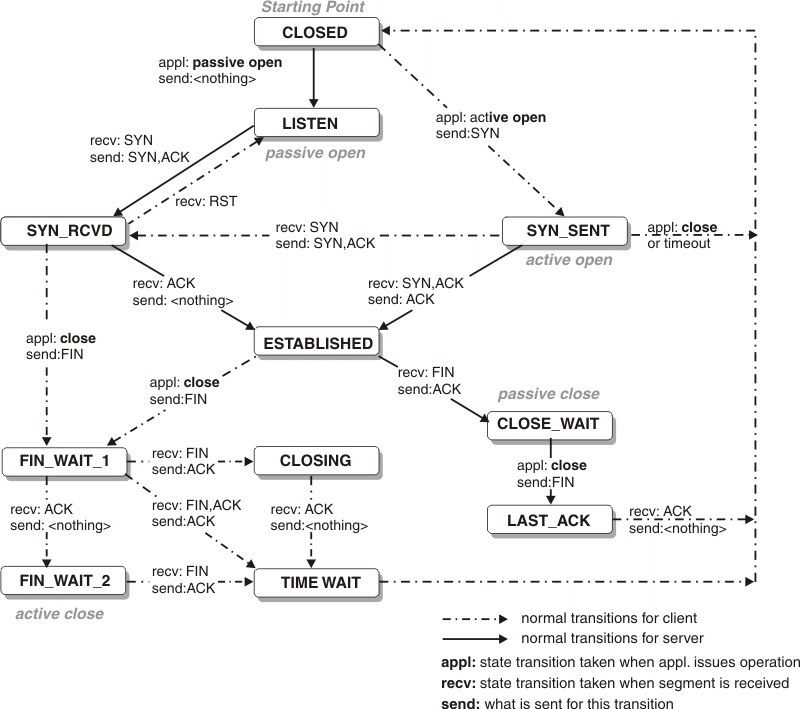

# TCP

## TCP状态

| 状态           | 说明                                         |
| ------------ | ------------------------------------------ |
| LISTEN       | 等待从任何远端TCP 和端口的连接请求                        |
| SYN_SENT     | 发送完一个连接请求后等待一个匹配的连接请求                      |
| SYN_RECEIVED | 发送连接请求并且接收到匹配的连接请求以后等待连接请求确认               |
| ESTABLISHED  | 表示一个打开的连接，接收到的数据可以被投递给用户。连接的数据传输阶段的正常状态    |
| FIN_WAIT_1   | 等待远端TCP 的连接终止请求，或者等待之前发送的连接终止请求的确认         |
| FIN_WAIT_2   | 等待远端TCP 的连接终止请求                            |
| CLOSE_WAIT   | 等待本地用户的连接终止请求                              |
| CLOSING      | 等待远端TCP 的连接终止请求确认                          |
| LAST_ACK     | 等待先前发送给远端TCP 的连接终止请求的确认（包括它字节的连接终止请求的确认）   |
| TIME_WAIT_1  | 等待足够的时间过去以确保远端TCP 接收到它的连接终止请求的确认           |
| TIME_WAIT_2  | 1.可靠的实现tcp全双工连接的终止；  2.允许老的重复分节在网络中消逝。 |
| CLOSED       | 不在连接状态（这是为方便描述假想的状态，实际不存在）                 |

-----

## 三次握手

## 四次挥手

----

## FAQ

### TCP连接的时候是3次

### 关闭的时候却是4次

因为只有在客户端和服务端都没有数据要发送的时候才能断开TCP。而客户端发出FIN报文时只能保证客户端没有数据发了，服务端还有没有数据发客户端是不知道的。而服务端收到客户端的FIN报文后只能先回复客户端一个确认报文来告诉客户端我服务端已经收到你的FIN报文了，但我服务端还有一些数据没发完，等这些数据发完了服务端才能给客户端发FIN报文(所以不能一次性将确认报文和FIN报文发给客户端，就是这里多出来了一次)。

### 为什么客户端发出第四次挥手的确认报文后要等2MSL的时间才能释放TCP连接？

这里同样是要考虑丢包的问题，如果第四次挥手的报文丢失，服务端没收到确认ack报文就会重发第三次挥手的报文，这样报文一去一回最长时间就是2MSL，所以需要等这么长时间来确认服务端确实已经收到了。

> MSL是 Maximum Segment Lifetime 的英文缩写，可译为`最长报文段寿命`，它是任何报文在网络上存在的最长的最长时间，超过这个时间报文将被丢弃。
> 
> 我们都知道IP头部中有个TTL字段，TTL是`time to live`的缩写，可译为`生存时间`，这个生存时间是由源主机设置设置初始值但不是存在的具体时间，而是一个IP数据报可以经过的最大路由数，每经过一个路由器，它的值就减1，当此值为0则数据报被丢弃
> 
> ，同时发送ICMP报文通知源主机。
> 
> RFC793 中规定MSL为2分钟，但这完全是从工程上来考虑，对于现在的网络，MSL=2分钟可能太长了一些。因此TCP允许不同的实现可根据具体情况使用更小的MSL值。TTL与MSL是有关系的但不是简单的相等关系，MSL要大于TTL。

### 如果已经建立了连接，但是客户端突然出现故障了怎么办？

TCP设有一个保活计时器，客户端如果出现故障，服务器不能一直等下去，白白浪费资源。服务器每收到一次客户端的请求后都会重新复位这个计时器，时间通常是设置为2小时，若两小时还没有收到客户端的任何数据，服务器就会发送一个探测报文段，以后每隔75秒钟发送一次。若一连发送10个探测报文仍然没反应，服务器就认为客户端出了故障，接着就关闭连接。

## 参考链接

[网络编程面试题（2020最新版）_ThinkWon的博客-CSDN博客](https://blog.csdn.net/ThinkWon/article/details/104903925)

https://www.ibm.com/docs/en/zos/2.1.0?topic=SSLTBW_2.1.0/com.ibm.zos.v2r1.halu101/constatus.html
