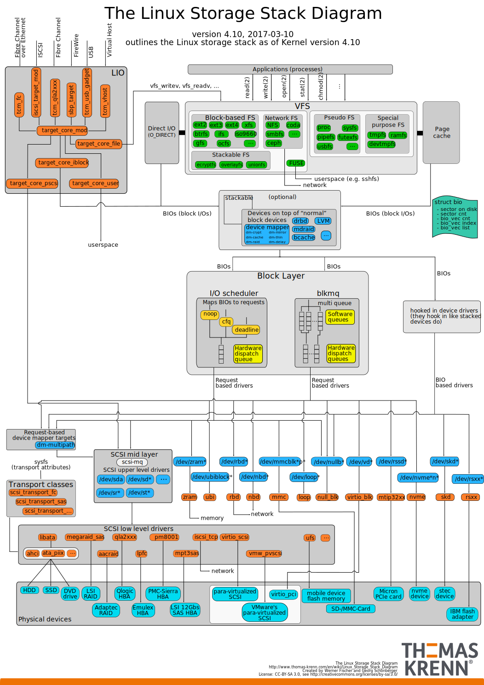

# Device Mapper

Device Mapper(设备映射器)是 Linux 内核提供的一个卷管理框架，是一个内核驱动程序,用于将物理块设备映射到更高级别的虚拟块设备。 它构成了逻辑卷管理器 (LVM)、软件 RAID 和 dm-crypt 磁盘加密的基础，并提供了文件系统快照等附加功能。

Device Mapper 的工作原理是将数据从虚拟块设备（由 Device Mapper 本身提供）传递到另一个块设备。 数据也可以在转换中进行修改，例如，在 Device Mapper 提供 磁盘加密 或 模拟不可靠硬件行为 的情况下执行此操作。

## 参考链接

[Appendix A. The Device Mapper Red Hat Enterprise Linux 7 | Red Hat Customer Portal](https://access.redhat.com/documentation/en-us/red_hat_enterprise_linux/7/html/logical_volume_manager_administration/device_mapper)

