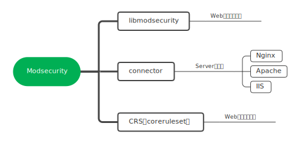

## 简介

ModSecurity是一个开源的、跨平台的Web应用防火墙(WAF)，可用于Apache，IIS和Nginx。ModSecurity 有3个部分组成:

## 参考资料

https://github.com/SpiderLabs/ModSecurity/wiki/ModSecurity-Frequently-Asked-Questions-%28FAQ%29

http://jiagoushi.pro/book/export/html/590

https://www.modsecurity.org/developers.html

https://www.trustwave.com/en-us/resources/blogs/spiderlabs-blog/

http://www.modsecurity.cn/
