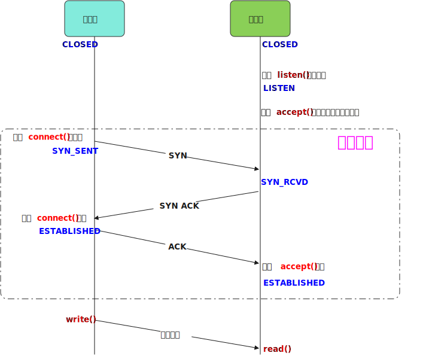

# TCP三次握手

> Three-Way Handshake, [RFC793](https://www.ietf.org/rfc/rfc793.txt)

### 三次握手中的TCP状态

| TCP状态       | 说明                                                              |     |
| ----------- | --------------------------------------------------------------- | --- |
| CLOSED      | 初始状态，表示TCP连接是“关闭着的”或“未打开的"                                      |     |
| LISTEN      | 示服务器端的某个SOCKET处于监听状态，可以接受客户端的连接                                 |     |
| SYN_SENT    | 当客户端SOCKET执行`connect()`进行连接时，它首先发送`SYN`报文，然后随即进入到 `SYN_SENT` 状态 |     |
| SYN_RCVD    | 表示服务器接收到了来自客户端请求连接的 `SYN` 报文                                    |     |
| ESTABLISHED | 表示TCP连接已经成功建立                                                   |     |

### 为什么要进行第三次握手？

> 客户端接收到 `SYN ACK` 后说明其发送`SYN`包服务端正确接收, 此时说明客户端发送通道OK, 接收通道OK, 所以进入 `ESTABLISHED` 状态。

> 服务端接收到 `SYN` 后, 只能说明其接收通道OK, 随后发送的`SYN ACK` 不知道客户端是否正确接收, 所以需要客户端发送`ACK`确认才能证明发送通道OK。

在谢希仁著《计算机网络》第四版中讲“三次握手”的目的是“为了防止已失效的连接请求报文段突然又传送到了服务端，因而产生错误”。在另一部经典的《计算机网络》一书中讲“三次握手”的目的是为了解决“网络中存在延迟的重复分组”的问题。这两种不用的表述其实阐明的是同一个问题。

谢希仁版《计算机网络》中的例子是这样的，“已失效的连接请求报文段”的产生在这样一种情况下：client发出的第一个连接请求报文段并没有丢失，而是在某个网络结点长时间的滞留了，以致延误到连接释放以后的某个时间才到达server。本来这是一个早已失效的报文段。但server收到此失效的连接请求报文段后，就误认为是client再次发出的一个新的连接请求。于是就向client发出确认报文段，同意建立连接。假设不采用“三次握手”，那么只要server发出确认，新的连接就建立了。由于现在client并没有发出建立连接的请求，因此不会理睬server的确认，也不会向server发送数据。但server却以为新的运输连接已经建立，并一直等待client发来数据。这样，server的很多资源就白白浪费掉了。采用“三次握手”的办法可以防止上述现象发生。例如刚才那种情况，client不会向server的确认发出确认。server由于收不到确认，就知道client并没有要求建立连接.

### References

[TCP11种状态_wk_bjut_edu_cn的博客-CSDN博客_tcp状态](https://blog.csdn.net/wk_bjut_edu_cn/article/details/82343939)

https://www.zhihu.com/question/24853633
