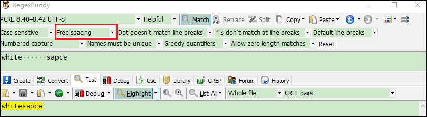

# OpenResty中的正则表达式

传统

openresty中正则表达式

## ngx.re.match

**syntax:** *captures, err = ngx.re.match(subject, regex, options?, ctx?, res_table?)*

**context:** *init_worker_by_lua*, set_by_lua*, rewrite_by_lua*, access_by_lua*, content_by_lua*, header_filter_by_lua*, body_filter_by_lua*, log_by_lua*, ngx.timer.*, balancer_by_lua*, ssl_certificate_by_lua*, ssl_session_fetch_by_lua*, ssl_session_store_by_lua*, exit_worker_by_lua**

使用PCRE的pattern `regex`  和选项`options`去匹配字符串 `subject` .

Only the first occurrence of the match is returned, or `nil` if no match is found. In case of errors, like seeing a bad regular expression or exceeding the PCRE stack limit, `nil` and a string describing the error will be returned.

When a match is found, a Lua table `captures` is returned, where `captures[0]` holds the whole substring being matched, and `captures[1]` holds the first parenthesized sub-pattern's capturing, `captures[2]` the second, and so on.

```lua
 local m, err = ngx.re.match("hello, 1234", "[0-9]+") if m then
     -- m[0] == "1234"

 else
     if err then
         ngx.log(ngx.ERR, "error: ", err)         return
     end

     ngx.say("match not found") end
```

```lua
 local m, err = ngx.re.match("hello, 1234", "([0-9])[0-9]+") -- m[0] == "1234"
 -- m[1] == "1"
```

Named captures are also supported since the `v0.7.14` release and are returned in the same Lua table as key-value pairs as the numbered captures.

```lua
 local m, err = ngx.re.match("hello, 1234", "([0-9])(?<remaining>[0-9]+)") -- m[0] == "1234"
 -- m[1] == "1"
 -- m[2] == "234"
 -- m["remaining"] == "234"
```

Unmatched subpatterns will have `false` values in their `captures` table fields.

```lua
 local m, err = ngx.re.match("hello, world", "(world)|(hello)|(?<named>howdy)") -- m[0] == "hello"
 -- m[1] == false
 -- m[2] == "hello"
 -- m[3] == false
 -- m["named"] == false
```

Specify `options` to control how the match operation will be performed. The following option characters are supported:

| Lua Flag | PCRE C Library                           |                                                           |
| -------- | ---------------------------------------- | --------------------------------------------------------- |
| a        | PCRE_ANCHORED                            | anchored mode (only match from the beginning)             |
| d        | `pcre_dfa_exec()`                        | 开启DFA模式                                                   |
| D        | PCRE_DUPNAMES                            | enable duplicate named pattern support                    |
| i        | PCRE_CASELESS                            | 忽略大小写                                                     |
| j        | `pcre_study()`<br>PCRE_STUDY_JIT_COMPILE | 开启 JIT 编译支持                                               |
| J        | PCRE_JAVASCRIPT_COMPAT                   | 开启 Javascript 兼容模式                                        |
| m        | PCRE_MULTILINE                           | 开启多行模式<br>`^` 和 `$`  能够匹配数据中的换行符,注意只支持LF的换行,不支持CR或者LFCR换行 |
| o        | -                                        | 开启只编译一次模式<br>worker级别的正则缓存                                |
| s        | PCRE_DOTALL                              | 开启单行模式<br> `.`会匹配换行符(`\r`和`\n`)                           |
| u        | PCRE_UTF8                                | 开启UTF-8模式                                                 |
| U        | PCRE_UTF8\|PCRE_NO_UTF8_CHECK            | 开启UTF-8模式, 但是不检测UTF8的有效性                                  |
| x        | PCRE_EXTENDED                            | 开启扩展模式<br>模式中的空白字符, 和“#”到换行符之间的字符都被忽略                     |


扩展模式



```nginx
 local m, err = ngx.re.match("hello, world", "HEL LO", "ix") -- m[0] == "hello"
```

```nginx
 local m, err = ngx.re.match("hello, 美好生活", "HELLO, (.{2})", "iu") -- m[0] == "hello, 美好" -- m[1] == "美好"
```

The `o` option is useful for performance tuning, because the regex pattern in question will only be compiled once, cached in the worker-process level, and shared among all requests in the current Nginx worker process. The upper limit of the regex cache can be tuned via the [lua_regex_cache_max_entries](https://github.com/openresty/lua-nginx-module#lua_regex_cache_max_entries) directive.

The optional fourth argument, `ctx`, can be a Lua table holding an optional `pos` field. When the `pos` field in the `ctx` table argument is specified, `ngx.re.match` will start matching from that offset (starting from 1). Regardless of the presence of the `pos` field in the `ctx` table, `ngx.re.match` will always set this `pos` field to the position *after* the substring matched by the whole pattern in case of a successful match. When match fails, the `ctx` table will be left intact.

```lua
 local ctx = {} local m, err = ngx.re.match("1234, hello", "[0-9]+", "", ctx)      -- m[0] = "1234"
      -- ctx.pos == 5
```

```lua
 local ctx = { pos = 2 } local m, err = ngx.re.match("1234, hello", "[0-9]+", "", ctx)      -- m[0] = "234"
      -- ctx.pos == 5
```

The `ctx` table argument combined with the `a` regex modifier can be used to construct a lexer atop `ngx.re.match`.

Note that, the `options` argument is not optional when the `ctx` argument is specified and that the empty Lua string (`""`) must be used as placeholder for `options` if no meaningful regex options are required.

This method requires the PCRE library enabled in Nginx ([Known Issue With Special Escaping Sequences](https://github.com/openresty/lua-nginx-module#special-escaping-sequences)).

To confirm that PCRE JIT is enabled, activate the Nginx debug log by adding the `--with-debug` option to Nginx or OpenResty's `./configure` script. Then, enable the "debug" error log level in `error_log` directive. The following message will be generated if PCRE JIT is enabled:

```
pcre JIT compiling result: 1
```

Starting from the `0.9.4` release, this function also accepts a 5th argument, `res_table`, for letting the caller supply the Lua table used to hold all the capturing results. Starting from `0.9.6`, it is the caller's responsibility to ensure this table is empty. This is very useful for recycling Lua tables and saving GC and table allocation overhead.

This feature was introduced in the `v0.2.1rc11` release.

### ngx.re.gmatch

### ngx.re.find

**syntax:** *from, to, err = ngx.re.find(subject, regex, options?, ctx?, nth?)*

**context:** *init_worker_by_lua*, set_by_lua*, rewrite_by_lua*, access_by_lua*, content_by_lua*, header_filter_by_lua*, body_filter_by_lua*, log_by_lua*, ngx.timer.*, balancer_by_lua*, ssl_certificate_by_lua*, ssl_session_fetch_by_lua*, ssl_session_store_by_lua*, exit_worker_by_lua**

Similar to [ngx.re.match](https://github.com/openresty/lua-nginx-module#ngxrematch) but only returns the beginning index (`from`) and end index (`to`) of the matched substring. The returned indexes are 1-based and can be fed directly into the [string.sub](https://www.lua.org/manual/5.1/manual.html#pdf-string.sub) API function to obtain the matched substring.

In case of errors (like bad regexes or any PCRE runtime errors), this API function returns two `nil` values followed by a string describing the error.

If no match is found, this function just returns a `nil` value.

### ngx.re.sub

### ngx.re.gsub
