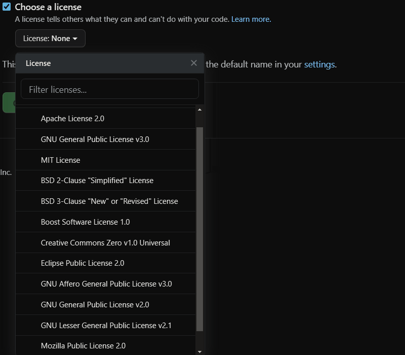

# 各种开源协议

|         |                                         |     |     |
| ------- | --------------------------------------- | --- | --- |
| MIT     | MIT License                             |     |     |
| Apache  | Apache License 2.0                      |     |     |
| BSD 2   | BSD 2-Clause "Simlified" License        |     |     |
| BSD 3   | BSD 3-Clause "New" or "Revised" License |     |     |
| GPL 2.0 | GNU General Public License v2.0         |     |     |
| GPL 3.0 | GNU General Public License v3.0         |     |     |
| LGPL    | GNU Lesser General Public License v2.1  |     |     |
| AGPL    | GNU Affero General Public License v3.0  |     |     |
| MPL     | Mozilla Public License                  |     |     |
|         | Boost Software License 1.0              |     |     |
|         | Creative Commons Zero v1.0 Universal    |     |     |

