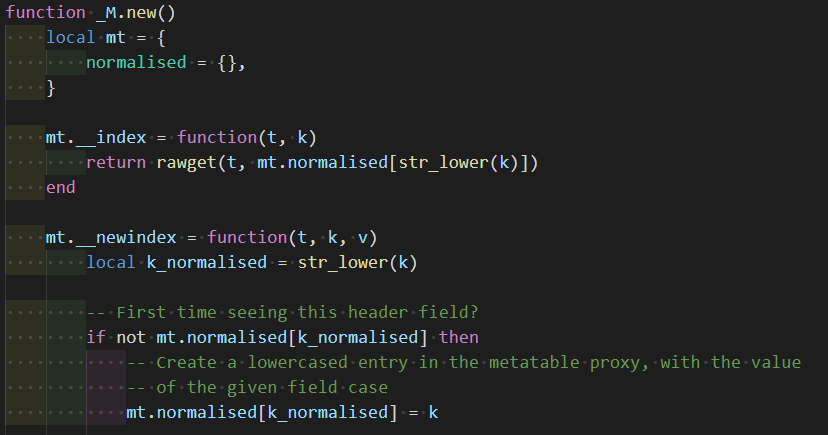
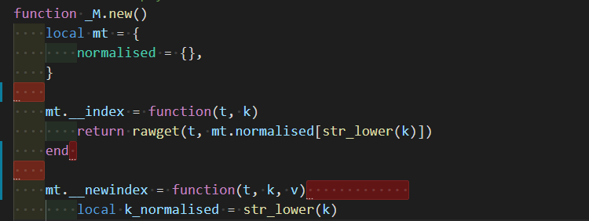

# VSCODE 常见配置

## 常用配置

### 在vscode中显示空格和tab符号

File -> Preferences -> Settings -> renderControlCharacters [enable]

File -> Preferences -> Settings -> renderWhitespace [all]

### 设置字体

写代码必须使用等宽类型字体

File -> Preferences -> Settings -> Editor:FontSize [22]

### tab 自动转换为空格

File -> Preferences -> Settings -> Editor:Insert Spaces [enable]

## 通用插件

### Indent-Rainbow

缩进使用不同颜色显示, 更加直观

### Trailing Spaces

高亮冗余的空格

