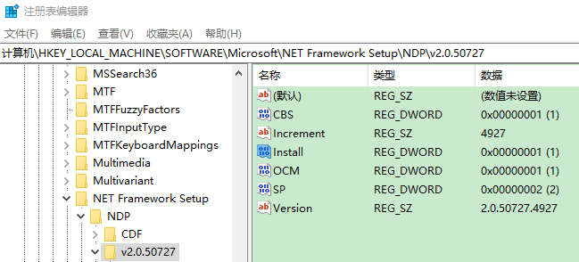

# 安装过程中读注册表

安装程序通常需要在安装过程中查找注册表项的值。
生成的注册表值通常用于稍后安装的条件语句中，
例如在未找到注册表项的情况下安装特定组件。
本文将演示如何从注册表中读取一个整数值并验证它是否存在于启动条件中。

## Step 1: 将注册表项读入属性

使用 [<RegistrySearch>](others/wix3/xsd/wix/registrysearch.html.md) 元素读取注册表项。
以下代码段查找标识在目标计算机上安装 .NET Framework 2.0 的注册表项是否存在。

```xml
<Property Id="NETFRAMEWORK20">
    <RegistrySearch Id="NetFramework20"
                    Root="HKLM"
                    Key="Software\Microsoft\NET Framework Setup\NDP\v2.0.50727"
                    Name="Install"
                    Type="raw" />
</Property>
```

RegistrySearch 元素指定唯一的 id、要搜索的注册表中的根以及要查找的键。
name 属性指定要查询的特定值。 type 属性指定应如何处理该值。
Raw 表示该值应根据值的数据类型添加前缀。 在这种情况下，由于 Install 是一个 DWORD，结果值将在前面加上一个 #。
如果找到注册表项，上面的示例会将 NETFRAMEWORK20 属性设置为“#1”，如果没有找到，则设置为空。



## Step 2: Use the property in a condition

设置属性后，您可以在 WiX 项目的任何位置使用它。
以下代码段演示了如何在未安装 .NET Framework 2.0 的情况下使用它来阻止安装。

```xml
<Condition Message="This application requires .NET Framework 2.0. Please install the .NET Framework then run this installer again.">
    <![CDATA[Installed OR NETFRAMEWORK20]]>
</Condition>
```

Installed 是 Windows Installer 属性，可确保仅在用户安装应用程序时进行检查，而不是在修复或删除时进行。
如果设置了该属性，则条件的 NETFRAMEWORK20 部分将通过。 如果未设置，安装程序将显示错误消息，然后中止安装过程。