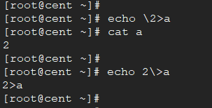

# 重定向

重定向(redirection)用于为当前 `shell执行环境` 打开和关闭文件。

用于重定向的通用格式是：

```bash
[n]redir-op word
```

数字 `n` 是一个可选的十进制数字，指定文件描述符(file descriptors)编号； 通常系统中最少需要支持的范围为 `[0, 9]`。特别的是 `0` 表示标准输入, `1`表示标准输入,`2`表示标准错误，这3个描述符默认的目标文件(设备)分别是`/dev/stdin`、`/dev/stdout`、`/dev/stderr`，它们分别是各个终端字符设备的软链接。

```bash
[linux ~]$ ll /dev/std*
lrwxrwxrwx 1 root root 15 Jun 18 09:26 /dev/stderr -> /proc/self/fd/2
lrwxrwxrwx 1 root root 15 Jun 18 09:26 /dev/stdin -> /proc/self/fd/0
lrwxrwxrwx 1 root root 15 Jun 18 09:26 /dev/stdout -> /proc/self/fd/1

[linux ~]$ ll /proc/self/fd
lrwx------ 1 root root 64 Jun 24 16:54 0 -> /dev/pts/0
lrwx------ 1 root root 64 Jun 24 16:54 1 -> /dev/pts/0
lrwx------ 1 root root 64 Jun 24 16:54 2 -> /dev/pts/0
lr-x------ 1 root root 64 Jun 24 16:54 3 -> /proc/80519/fd
```

如果要打开其他文件，则文件描述符必须从3开始标识。对于我们人为要打开的描述符，建议使用9以内的描述符，超过9的描述符可能已经被系统内部分配给其他进程。

应用程序应确保它与任何前面的文本分开并紧跟在重定向操作符 `redir-op` 之前。 如果 `n` 被引用，则该数字不应被识别为重定向表达式的一部分。

例如：

```bash
echo \2>a   # 如果2前不加'\'转义,则表示把标准错误输出写入文件 a
```

这条语句的意思是把字符 `2`  写入文件 `a` 中。

如果引用了 `redir-op` 的任何部分，则无法识别重定向表达式, 例如:

```bash
echo 2\>a  # 这里重定向符号 '>' 被其前面的 \'' 转义, '\>' 就表示 '>' 字符本身, 所以这条语句就是echo后面的字符串了
```



---

### 输入重定向

输入重定向的语法是:

```bash
[n]<filename
```

`n` 表示文件描述符, 如果省略 `n` , 则 `n`的默认值为`0` 即标准输入。

输入重定向将导致名称为 `filename` 的文件被打开读取，并将读取的内容发送到文件描述符 `n` 指定的文件中。

他的用处是在一些需要交互输入的地方

MySQL从文件导入数据

```bash
mysql -uroot -p123456 < data.sql
```

---

### 输出重定向

输出重定向有下面两种格式：

```bash
[n]>filename
[n]>|filename
```

`n` 表示文件描述符, 如果省略 `n` , 则 `n`的默认值为`1` 即标准输出。

如果设置了 noclobber 选项（参见 set -C 的描述）并且由 word 扩展命名的文件存在并且是一个常规文件，则使用“>”格式的输出重定向将失败。 否则，使用“>”或“>|”重定向 格式应导致名称由单词扩展产生的文件被创建并打开以在指定的文件描述符上输出，如果没有指定，则为标准输出。 如果文件不存在，则创建； 否则，打开后将被截断为空文件。

### 追加式输出重定向

追加式输出重定向将导致名称由单词扩展产生的文件被打开以在指定的文件描述符上输出。 该文件被打开，就好像 POSIX.1-2017 的系统接口卷中定义的 open() 函数是用 O_APPEND 标志调用的。 如果该文件不存在，则应创建该文件。

```bash
[n]>>word
```

`n` 同样表示文件描述符, 如果省略 `n` , 则 `n`的默认值为`1` 即标准输出。

### Heredoc

重定向操作符 `<<`  和 `<<-` 允许将 shell 读取的后续行重定向到命令的输入。 重定向的行被称为“here-document”。

```bash
[n]<<word
    here-document
delimiter
```

`n` 同样表示文件描述符, 如果省略 `n` , 则 `n`的默认值为`0` 即标准输入。

如果word的任何部分被引用，则对word进行引用去除形成分隔符，并且不得扩展here-document行。否则，分隔符应为单词本身。

如果没有引用 word 的任何部分，则此处文档的所有行都应进行参数扩展、命令替换和算术扩展。 在这种情况下，输入中的 <backslash> 表现为双引号内的 <backslash>（请参阅双引号）。 但是，双引号字符 ( ' )' 在 here-document 中不应被特殊对待，除非双引号出现在 "$()"、"``" 或 "${}" 中。

如果重定向运算符是“<<-”，则所有前导 <tab> 字符都应从输入行和包含尾随定界符的行中删除。 如果在一行中指定了多个“<<”或“<<-”运算符，则与第一个运算符关联的 here-document 应首先由应用程序提供，并应首先由 shell 读取。

当从终端设备读取 here-document 并且 shell 是交互式的时，它应该在读取每一行输入之前将变量 PS2 的内容写入标准错误，直到识别出分隔符。


### 复制输入文件描述符

```bash
[n]<&word
```

应该从另一个复制一个输入文件描述符，或者应该关闭一个。 如果 word 计算为一个或多个数字，则由 n 表示的文件描述符或如果未指定 n 的标准输入，则应成为由 word 表示的文件描述符的副本； 如果 word 中的数字不代表已打开供输入的文件描述符，则会导致重定向错误； 请参阅 Shell 错误的后果。 如果 word 评估为“-”，则文件描述符 n 或标准输入（如果未指定 n）应关闭。 尝试关闭未打开的文件描述符不应构成错误。 如果 word 评估为其他内容，则行为未指定。

### 复制输出文件描述符

```bash
[n]>&word
```

应该从另一个复制一个输出文件描述符，或者应该关闭一个。 如果 word 计算为一个或多个数字，则由 n 表示的文件描述符，或如果未指定 n 的标准输出，应作为由 word 表示的文件描述符的副本； 如果 word 中的数字不代表已经打开用于输出的文件描述符，则会导致重定向错误； 请参阅 Shell 错误的后果。 如果 word 的计算结果为“-”，则文件描述符 n 或标准输出（如果未指定 n）将关闭。 尝试关闭未打开的文件描述符不应构成错误。 如果 word 评估为其他内容，则行为未指定。

### 用于读写的打开文件描述符

重定向运算符如下:

```bash
[n]<>word
```

将导致名称为 word 扩展的文件被打开，以便在由 `n` 表示的文件描述符上读取和写入，如果未指定 `n`，则为标准输入。如果该文件不存在，则应创建该文件。


### References

[Shell 输入/输出重定向 | 菜鸟教程](https://www.runoob.com/linux/linux-shell-io-redirections.html)

[Shell中的文件重定向_lzjsqn的专栏-CSDN博客](https://blog.csdn.net/lzjsqn/article/details/53573269)

[彻底搞懂shell的高级I/O重定向 - 骏马金龙 - 博客园](https://www.cnblogs.com/f-ck-need-u/p/8727401.html)


