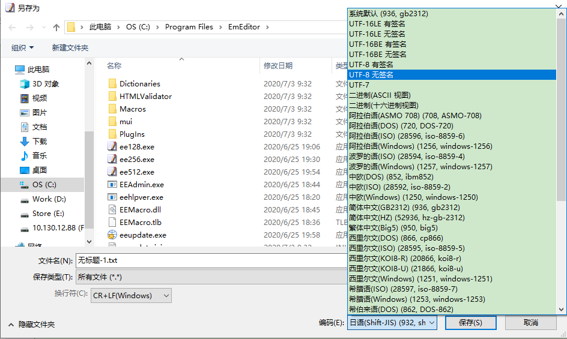

# HTML5 简介

html(HyperText Markup Language), 超文本标记语言,是一种用于创建网页的标准标记语言。

**源码文件后缀名**

html源码文件的后缀名为 `.html` 或 `.htm`。
`.htm` 是来源于旧时的windows操作系统只支持长度为三个字符的后缀名，所以是 `.htm`。
在现代操作系统中已经没有此种限制， 所以推荐使用统一的后缀 `.html` 。

> https://www.runoob.com/html/html-tutorial.html

**源码文件编码格式**

中文网页通常需要设置为 'UTF-8' 或者 'GBK', 文件的格式要与声明的 charset 一致。

现在大部分高级的编辑器默认创建的文件文件都是UTF-8编码的，比较好的编辑器如 EmEditor 支持另存为各种编码格式的功能。



> UTF8文件带签名的签名指的是 BOM(Byte Order Mark), 即文件最开头会多几个字节用于表示文件的编码格式, 
> 不支持BOM的文本编译器打开带有BOM的文本时,最上方会有乱码。不建议使用签名。

**HTML注释**

单行注释:

```html
<!-- 这是一个单行注释 -->
```

多行注释:

```html
<!--
    这是多行注释
    这是多行注释
    这是多行注释
-->
```

**HTML5声明**

`<!DOCTYPE html>` 是标示语句, 声明使用 HTML5 标准, 处于 `<html>` 标签之前。告知浏览器文档使用哪种 HTML 或 XHTML 规范。

doctype 声明是不区分大小写,下面的写法都是正确的

```html
<!DOCTYPE html>
<!DOCTYPE HTML>
<!doctype html>
<!Doctype Html> 
```

在HTML 4.01 中，`<!DOCTYPE>` 声明需引用 DTD(文档类型声明),
因为 HTML 4.01 是基于 SGML（Standard Generalized Markup Language 标准通用标记语言）。
HTML 4.01 规定了三种不同的 `<!DOCTYPE>` 声明，分别是：Strict、Transitional 和 Frameset。
HTML5 不是基于 SGML，因此不要求引用 DTD。

> doctype 声明详细见 https://www.runoob.com/tags/tag-doctype.html

**HTML标签**

- HTML 标签(HTML tag)是由尖括号包围的关键词。
- HTML 标签通常是成对出现的，比如 `<b>` 和 `</b>`, 也有特殊的如 `<br>`
- 标签对中的第一个标签是开始标签(开放标签)，第二个标签是结束标签(闭合标签)
- 标签要用小写字母（有些版本对大小写可认为相同，而xhtml中强制使用小写）

**HTML元素**

"HTML 标签" 和 "HTML 元素" 通常都是描述同样的意思.
但是严格来讲, 一个 HTML 元素包含了开始标签与结束标签。

**HTML空元素**

没有内容的 HTML 元素被称为空元素。空元素是在开始标签中关闭的。
`<br>` 就是没有关闭标签的空元素。
在 XHTML、XML 以及未来版本的 HTML 中，所有元素都必须被关闭。
在开始标签中添加斜杠，比如 `<br />`，是关闭空元素的正确方法，HTML、XHTML 和 XML 都接受这种方式。
即使 `<br>` 在所有浏览器中都是有效的，但使用 `<br />` 其实是更长远的保障。

**HTML标题**

HTML 标题（Heading）是通过`<h1> - <h6>` 标签来定义的。对应的是 1~6 级标题。
一级标题最大，六级标题最小。浏览器会自动地在标题的前后添加空行。

标题很重要，不要仅仅是为了生成粗体或大号的文本而使用标题。
搜索引擎使用标题为您的网页的结构和内容编制索引。
因为用户可以通过标题来快速浏览您的网页，所以用标题来呈现文档结构是很重要的。

1号标题对应 size="6" 的字体, 2号标题对应 size="5" 的字体, 以此类推。

```html
<h1>这是一级标题</h1>
<h2>这是二级标题</h2>
<h3>这是三级标题</h3>
<h4>这是四级标题</h4>
<h5>这是五级标题</h5>
<h6>这是六级标题</h6>
```

**HTML段落**

HTML 段落是通过标签 <p> 来定义的。
浏览器会自动地在段落的前后添加空行（`</p>` 是块级元素）。

```html
<p>这是一个段落。</p>
<p>这是另外一个段落。</p>
```

**HTML换行**

如果您希望在不产生一个新段落的情况下进行换行（新行），请使用 `<br>` 标签

```html
<p>这个<br>段落<br>演示了分行的效果</p>
```

`<br>` 是 HTML 写法。`<br/>` 是 XHTML 1.1 的写法, 也是 XML 写法。
`<br />` 是 XHTML 为兼容 HTML 的写法,也是 XML 写法。
HTML5 因为兼容 XHTML，所以三种写法都可以使用。

浏览器在显示 HTML 时，会省略源代码中多余的空白字符（空格或回车等）。
所以不能在html源码中手动排版。

**HTML水平线**

```html
<hr>
```

**HTML属性**

属性是 HTML元素提供的附加信息。属性一般在开始标签中定义, 属性总是以键值对的形式出现，比如：name="value"。
有的 HTML元素 拥有多个属性，之间使用空格分隔， 详见下面的 HTML图像。

属性值应该始终被包括在引号内。双引号是最常用的，不过使用单引号也没有问题。
在某些个别的情况下，比如属性值本身就含有双引号，那么您必须使用单引号，例如：name='John "ShotGun" Nelson'

**HTML链接**

使用 `herf` 属性定义链接

```html
<a href="https://blog.lubinlew.com">这是我的博客</a>
```

**HTML图像**

HTML 图像是通过标签 `` 来定义的.

```html

```