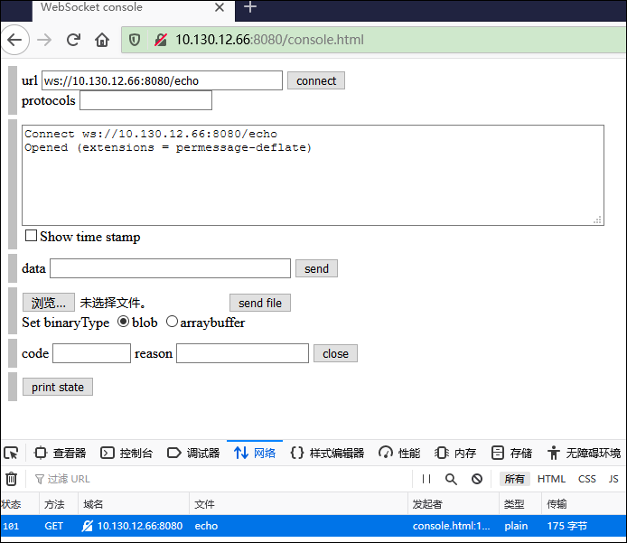
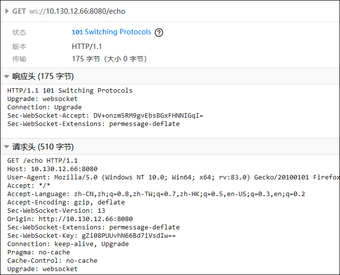

# WebSocket 服务器搭建

为了简单, 这里使用[pywebsocket3](https://github.com/GoogleChromeLabs/pywebsocket3)来搭建服务器。

## 编译安装

```bash
git clone https://github.com/GoogleChromeLabs/pywebsocket3.git
cd pywebsocket3

python3 setup.py build
python3 setup.py install
```

## 帮助文档

```bash
pydoc mod_pywebsocket.standalone
```

下面是常用的参数:

| 参数          | 说明                    | 备注     |
| ----------- | --------------------- | ------ |
| -p          | 端口                    |        |
| -d          | web服务的根目录             |        |
| -t          | 使用TLS加密，协议变为 `wss://` |        |
| -c          | 证书路径                  | 使用绝对路径 |
| -k          | 秘钥路径                  | 使用绝对路径 |
| --log-level | 日志级别                  |        |

## 启动服务

注意, 路径还在编译的路径 pywebsocket3 目录下, 里面有一个 example 文件夹。

```bash
python3 mod_pywebsocket/standalone.py -p 8080 -d example
```

## 访问服务

使用浏览器打开页面  `http://IP:8080/console.html` , 点击 connect 。



可以从开发者工具看到 出现了 `101` 响应码，服务协议从 HTTP 升级为 websocket 。



之后 send data 就使用 websocket 协议了。
